# lib

[](https://github.com/katoptra/lib/actions/workflows/ci.yml)
[](LICENSE)

The toolbox every katoptra mirror includes by URL. The rule it enforces: the code that
starts a run, contains it, resolves its secrets, checks it and reports it lives here,
once. The code that moves bytes for a transport lives here too, once per engine:
`engines/rsync.yml` for an rsync upstream into a bucket, `engines/proton.yml` for a
staging tree into Proton Drive. A mirror holds only its identity, the hooks it fills, and
the few verbs no other mirror shares.

This file is the manual. A mirror's README says what it mirrors and how to fork it, and
links here for everything the mirrors share. Read it top to bottom once and the system
should hold no surprises; after that, each section stands on its own.

## The system in one picture

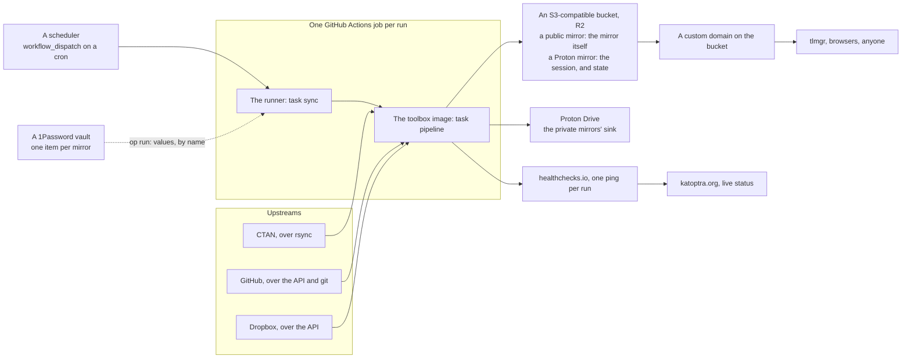

Every mirror is that picture with one upstream and one sink. A public mirror (ctan,
tlnet) copies an rsync tree into a bucket and serves the bucket; the bucket is the mirror.
A private mirror (github, dropbox) copies an account into Proton Drive and keeps only
what the next run needs in the bucket. Both run the same way: a job on GitHub Actions,
started by a dispatch, that pulls one image, resolves its secrets by name from a vault,
and runs `task pipeline` inside the image. The same command runs on a laptop.

## The layers

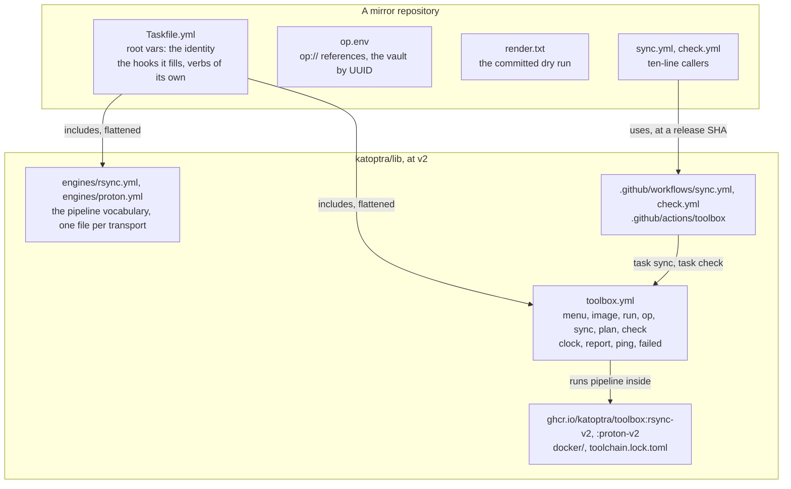

| Layer | Lives in | Owns | A mirror touches it when |
|---|---|---|---|
| Toolbox | `toolbox.yml` | How a run starts, is contained, resolves secrets, is rendered, checked and reported | Never; it is included as is |
| Engine | `engines/<transport>.yml` | How bytes move for one transport, and the pipeline's order | It lists a hook under `excludes:` and defines its own |
| Image | `docker/`, `toolchain.lock.toml` | Every tool a run needs, pinned by checksum | Never; it names one in `IMAGE` |
| Workflows | `.github/workflows`, `.github/actions/toolbox` | How Actions installs the tools and runs `task sync` and `task check` | Never; its callers are a few lines each |
| Mirror | The mirror's own repository | Identity, the hooks, the exceptions | Always; this is all it holds |

## What a run looks like

The same path on a laptop and in Actions. On a laptop it starts at `task sync`.

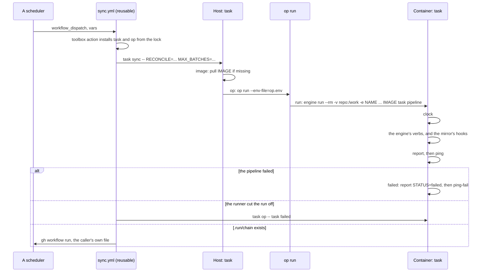

Four things the diagram hides:

- **Secrets cross by name, never by value.** `op run` resolves `op.env` on the host and
  exports the values; `run` passes `-e NAME` for each name in `op.env` and in `PASS`,
  plus `HEALTHCHECK_URL`, `GITHUB_STEP_SUMMARY` and `GITHUB_RUN_ID` always, so no value
  ever appears on a command line or in a log. The whole path is under [Secrets](#secrets).
- **The vault is read once per run.** One `op run` wraps the whole pipeline, and the
  failure path, `failed`, runs inside the same container, so a failed run costs no
  second read. The one exception is a run the runner cut off, by the timeout or a
  cancellation, which never reached its own failure path: the workflow runs `failed`
  again from outside, one more read on a rare day.
- **Nothing inside the container reaches the network for task itself.** The image sets
  `TASK_REMOTE_OFFLINE=1` and the mirror's `.task/remote` cache rides in with the repo.
- **`plan` is `sync` with the read-only half.** It runs `plan-pipeline` instead of
  `pipeline`, inside the same image with the same secrets.

## The toolbox

`toolbox.yml` is every verb a mirror has whatever moves its bytes. Half of its verbs run
on the host and wrap the container; the other half run inside it and are the first and
last steps of every pipeline.

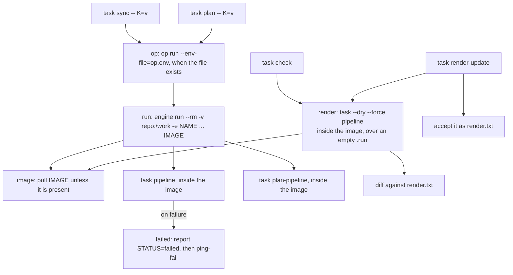

### Host side

The contract the workflows call and the menu documents. A mirror does not override these.

| Verb | Does |
|---|---|
| `default` | The grouped menu, from `NAME`, `DESC` and `MENU` |
| `sync -- [K=v ...]` | `op -- task pipeline`: one run. The words after `--` are task vars for the pipeline inside the image |
| `plan -- [K=v ...]` | `op -- task plan-pipeline`: the read-only half |
| `check` | `render`, then diff against `render.txt` |
| `render-update` | `render`, then accept it as `render.txt` |
| `render` | `task --dry --force pipeline` inside the image, over an empty `.run`, saved to `.run/render.txt`; no secrets cross |
| `run -- <cmd>` | Anything inside the image, with the repository at `/work` |
| `op -- <cmd>` | `run`, wrapped in `op run --env-file=op.env` when the file exists |
| `image` | Pull `IMAGE`; a no-op while it exists locally |
| `image-build` | Build `IMAGE` from `LIB_DIR/docker/<variant>.Dockerfile`; `LIB_DIR` defaults to `../lib` |
| `image-clean` | Remove `IMAGE` |
| `clean` | Delete `.run`, `staging` and the Taskfile cache; nothing else |

The container engine is Apple `container` when its daemon is up, else Docker;
`ENGINE=docker` forces Docker. The host needs go-task, the container engine, and the
1Password CLI for anything that reads the vault. Nothing else is installed on a host.

### Inside the image

The first and last verbs of every pipeline. A mirror or engine may override these when it
keeps its own.

| Verb | Does |
|---|---|
| `clock` | Write "epoch UTC-hour weekday" to `.run/start.txt` and forget the last run's chain file |
| `report` | Append the run summary to the Actions job page (stdout elsewhere): its own rows, then `report-engine`'s, then `report-mirror`'s |
| `report-engine`, `report-mirror` | Hooks: no-ops here; the engine's and the mirror's rows |
| `ping` | GET `HEALTHCHECK_URL`; skipped when unset |
| `ping-fail` | GET `HEALTHCHECK_URL/fail`; skipped when unset |
| `failed` | The failure path: `report STATUS=failed`, then `ping-fail` |

`sync` runs `pipeline`, and on a failure `failed`, all in the one container. The report
is one table in three layers, each a `| Label | value |` line appended to the same file:
the toolbox's rows (when the run started and how long it took, the image, whether the
next run is queued), the engine's, the mirror's. Every row tolerates a missing file,
because the report also runs after a failed pipeline.

### What a mirror gives the toolbox

| Name | Kind | Meaning |
|---|---|---|
| `NAME`, `DESC`, `IMAGE` | include vars, required | The menu's title and line, and the image the run happens inside |
| `pipeline`, `plan-pipeline` | tasks, required | The full run and its read-only half, inside the image. An engine supplies both; a mirror with no engine defines them |
| `op.env` | file | `op://` references, one per secret. Absent means the environment is already resolved: on a laptop, whatever is exported; in Actions, the repository's secrets, crossing by the names in `PASS` |
| `PASS` | include var | Host environment names that cross into the container beside the ones in `op.env`. Task vars are not environment: they go after `--` |
| `MENU` | include var | Extra lines for the menu, one per mirror-specific verb |
| `report-mirror` | task | The mirror's rows of the run summary. Excluded on the toolbox include |
| `LIB_DIR` | include var | Where `image-build` finds `docker/`; defaults to `../lib` |
| `excludes:` | include key | Library verbs the mirror replaces. See [Changing it](#changing-it) |

## The engines

An engine is a second include with the verbs for one transport. Its verbs are the
pipeline vocabulary, reserved across every engine so a mirror's pipeline reads the same
whichever transport it uses. An engine reads the mirror's root vars and the environment;
it declares no `vars:` default for anything a mirror owns, because a value there would
shadow the mirror's. Every tunable is an inline `{{.X | default N}}`.

The hooks are the verbs an engine leaves empty for a mirror to fill. A mirror lists each
it defines under `excludes:` on the engine's include. Extension is a hook, never a copy:
a mirror that needs the engine's `smoke` and more defines `smoke-mirror`, which `smoke`
runs last.

### The rsync engine

`engines/rsync.yml`: an rsync upstream into an S3 bucket, as a list diff and never a
local tree. The runner has 14 GB of disk and CTAN has 140; a run lists upstream, diffs
the listing against the state file the last run left in the bucket, and moves only the
delta, in batches, each committed before the next starts.

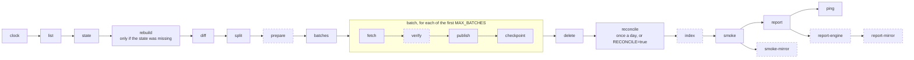

Dashed verbs are hooks. `prepare` and `verify` do nothing until `TL_KEY` is set; `index`
and `smoke-mirror` do nothing until a mirror fills them.

| Verb | Does |
|---|---|
| `pipeline`, `plan-pipeline` | The verbs above in order, and the read-only half: `clock`, `list`, `state`, `diff`, `split` |
| `list` | `rsync -rL --list-only` of `SOURCE`, through `FILTER`, normalised to `.run/upstream.txt` as `path TAB size TAB mtime`, byte-sorted; a listing under `LIST_FLOOR` lines stops the run |
| `state` | Fetch `.state/applied.txt.xz` from the bucket; a missing one asks `rebuild` |
| `rebuild` | List the bucket and make the state exactly what it holds, at upstream's sizes |
| `diff` | `changed.txt` (upstream has, the state lacks), `deleted.txt` (the state has, upstream lacks), `paths.txt` |
| `split` | Refuse a tree over `CEILING_GB` or a file the disk cannot hold; split the delta into `batch-NNNN.txt` of `BATCH_GB`, the decision batch last |
| `prepare` | Hook. With `TL_KEY` set and the delta touching `TL`: fetch the tlpdb and check its signature against the pinned key |
| `batches` | Work the first `MAX_BATCHES`, each `fetch`, `verify`, `publish`, `checkpoint`; touch `.run/chain` when batches remain |
| `fetch` | rsync the batch's files into `staging/`, dereferencing symlinks; a path that vanished since the listing is skipped |
| `verify` | Hook. With `TL_KEY` set: every signed file and every container in the batch against the tlpdb |
| `publish` | `aws s3 cp --recursive` of staging, one PutObject per file, never a destination listing; `timestamp` last |
| `checkpoint` | `merge` what landed into the state and push it as one PutObject; empty staging |
| `delete` | Remove the keys upstream dropped, 1,000 per call, once every batch has landed, and drop them from the state |
| `reconcile` | In the run that starts in hour 03 UTC, or with `RECONCILE=true`: rebuild the state, then delete what neither upstream, `OWN` nor the state's own directories own |
| `index` | Hook. Nothing here; a mirror that draws directory pages or a landing page replaces it |
| `smoke` | A sample of the run's keys read back through `HOST`, sizes against the listing; the tlpdb sha512 when `TL` is set; then `smoke-mirror` |
| `smoke-mirror` | Hook. Nothing here; a mirror with more to read back defines it |
| `report-engine` | Hook. The engine's rows of the run summary |
| `retry` | Run a command, retrying rsync's transport exit codes with backoff; 24 is a success |

`normalise`, `pull`, `push`, `batch`, `merge` and `remove` are the verbs those call;
`pull` and `push` move an xz-compressed key between the bucket and `.run`, and a
mirror's own verb may call them.

#### The bucket is the mirror; the state is a cache

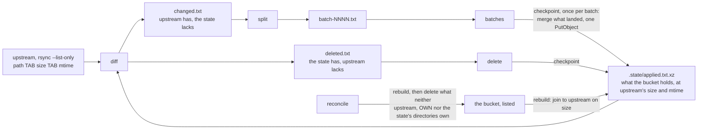

An hourly run costs one listing of upstream and none of the bucket. Three things follow.

- **There is no seed.** A missing state file is rebuilt from a listing of the bucket. An
  empty bucket gives an empty state, so the first run's delta is the whole tree, worked
  `MAX_BATCHES` at a time; when batches remain the run chains the next one, and the fill
  converges in a few chained runs with no flag. A lost state file costs the same listing
  and nothing else.
- **The state records what landed.** `merge` joins the batch against what is in staging,
  so a path that vanished upstream between listing and fetch never enters the state, and
  the state never names a key the bucket lacks.
- **`RECONCILE` is the check on a live mirror.** It rebuilds the state from the bucket on
  purpose, daily by default, and deletes keys neither upstream nor the state owns.

What a mirror cannot afford to lose is the bucket. Everything else, the state file and the
staging tree included, is derived from it and from upstream.

#### The decision batch

`split` puts last whatever a client reads to decide what to fetch: the signed subtree's
`tlpkg/` and every bucket-root file, `timestamp` among them. Containers land before the
tlpdb that names them, and `delete` waits for the run in which every batch has landed, so
the live tlpdb never names a removed container and a `tlmgr` run that overlaps a publish
sees the previous tlpdb, never one naming a file that is not there.

#### A signed subtree

With `TL` and `TL_KEY` set, the engine verifies TeX Live's signatures before anything is
published. The keyring is fetched from the same mirror as the signature, so the pinned
fingerprint is the only real check; `GOODSIG` is required too, because gpgv reports an
expired or revoked key as `VALIDSIG` with exit 0.

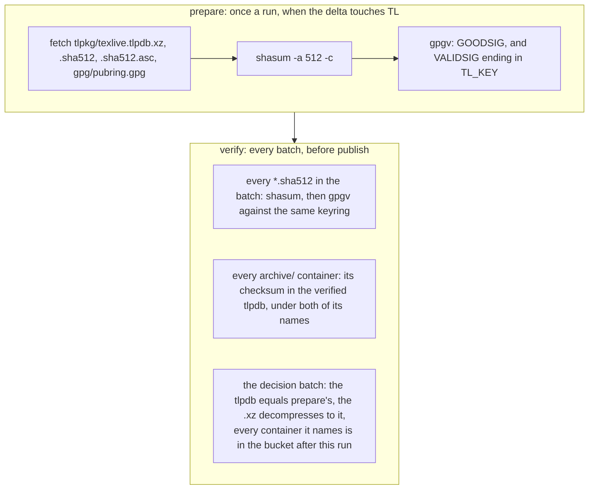

A batch that fails any check stays local; the previous good copy stays live. `smoke`
reads `texlive.tlpdb.sha512` back through the domain afterwards and compares it with the
verified copy. `tlmgr` repeats the signature check on the client.

#### The vars

A mirror sets `SOURCE`, `BUCKET` and `HOST` in its root vars, always. Everything else
has an inline default, and a mirror sets only what differs:

| Var | Default | Meaning |
|---|---|---|
| `CEILING_GB` | 0, no ceiling | `split` refuses a tree larger than this many decimal GB |
| `BATCH_GB` | 4 | Decimal GB per batch; a larger file is a batch by itself |
| `MAX_BATCHES` | 4 | Batches per run; the rest chain the next run |
| `LIST_FLOOR` | 0, no guard | A listing under this many lines is a truncated one, never a deletion list |
| `RECONCILE` | `auto` | `true`, `false`, or `auto`: the run that started in hour 03 UTC |
| `RETRY_BASE` | 15 | Seconds; the retry sleeps are `RETRY_BASE * 2^i` plus jitter |
| `TL`, `TL_KEY` | empty | A signed TeX Live subtree and the fingerprint that signs it; empty, no signature checks |
| `FILTER` | empty | rsync filter arguments that narrow the listing, for a mirror of a subtree |
| `OWN` | empty | Bucket-root keys the mirror owns, space separated; `reconcile` never deletes them |
| `INDEX` | empty | The key suffix of the directory pages a mirror's `index` draws; set, `reconcile` spares those pages and every bare directory of the state |

A var the mirror puts in its root `vars:` is fixed for every run: inside an included
verb a root value shadows a `KEY=value` from the command line. One the mirror leaves to
its default is the run's to set, `task sync -- MAX_BATCHES=8 RECONCILE=true`. So a root
var that restates a default is worse than none: it silences the command line.

### The proton engine

`engines/proton.yml`: a staging tree into one Proton Drive folder, through the official
`proton-drive` CLI, for a mirror whose upstream fits in a run. The mirror fills
`staging/` and the engine does the rest. It keeps nothing of the mirror's in the bucket
but the CLI session, because the CLI skips a file whose content Proton already holds and
`-f create-new-revision` makes a revision of one that changed: Proton's version history
is the history of the mirror.

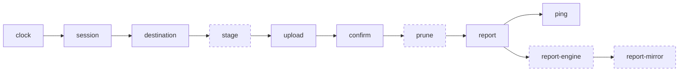

| Verb | Does |
|---|---|
| `pipeline`, `plan-pipeline` | The verbs above in order; the read-only half runs through `stage` and prints what an upload would carry |
| `session` | Pull `.state/session.tar.age` from the bucket, decrypt it with `MIRROR_AGE_IDENTITY`, extract the two session files to `.run/session` |
| `destination` | List the parent of `MIRROR_PROTON_DESTINATION` and refuse the run unless exactly one folder of that name exists and its UID is `MIRROR_PROTON_DESTINATION_UID` |
| `stage` | Hook. Every mirror defines it: fill `staging/` with what Proton should hold |
| `upload` | One `filesystem upload -f create-new-revision -d merge -t --json` of `staging/*` into the destination; the summary to `.run/upload.json` |
| `confirm` | Transferred plus skipped plus failed must equal the staged files plus folders, with no failure; the verdict to `.run/confirm.txt` |
| `prune` | Hook. Nothing here; a mirror that trashes what its upstream dropped defines it, from `list-folder` and `trash` |
| `pd` | Every CLI call: stderr to `.run/pd.err`, then the session sealed back to the bucket when its token rotated, whatever the exit |
| `list-folder`, `trash` | A folder's JSON listing to `OUT`; the nodes at `PATHS` to Proton's trash |
| `session-seal -- <dir>` | Host side: a laptop login's two files, encrypted into the bucket |
| `empty-trash` | Host side, asks first: everything in Proton's trash, permanently |
| `report-engine` | Hook. The engine's rows of the run summary |

The engine reads no root var. Its inputs are the environment, by the names every Proton
mirror's `op.env` carries:

| Name | What it is |
|---|---|
| `MIRROR_PROTON_DESTINATION` | The CLI path of the destination folder, `/my-files/GitHub` say |
| `MIRROR_PROTON_DESTINATION_UID` | Its UID, compared on every run before any write |
| `MIRROR_R2_BUCKET` | The bucket that holds the session |
| `MIRROR_AGE_IDENTITY` | The `AGE-SECRET-KEY-...` line the session is encrypted to |
| `AWS_ACCESS_KEY_ID`, `AWS_SECRET_ACCESS_KEY`, `AWS_ENDPOINT_URL_S3` | What boto3 reads; note `_S3` on the endpoint |

#### The session

The CLI can only be seeded by a browser sign-in, and fresh sign-ins from datacenter
addresses are blocked, so the session is made once on a laptop and carried to every run
encrypted. Its refresh token rotates on use, so every run writes it back.

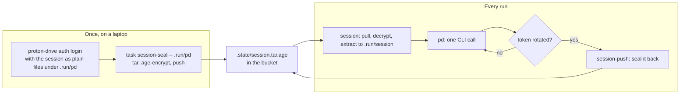

To make one:

```sh
export PROTON_DRIVE_CACHE_DIR=.run/pd PROTON_DRIVE_CREDENTIALS_STORE=unsafe_file
proton-drive auth login                                   # a browser opens; .run/pd holds two JSON files after
proton-drive filesystem create-folder /my-files <Name>    # /my-files is the drive's own root, not a folder you make
proton-drive filesystem list -j /my-files                 # the entry named <Name>: its uid is the destination UID
task session-seal -- .run/pd                              # once the bucket and the vault exist
```

Install the CLI at the version `toolchain.lock.toml` pins: the session file format is
tied to the version, and the Linux binary in the image must read what the laptop wrote.
`.run/pd` must be inside the repository, because only the repository is mounted into the
image; `.run/` is ignored by git and deleted by `task clean`.

Three rules. **Two mirrors never share a session**: its refresh token rotates on every
call, and the loser of a race needs a fresh login. **Never run `sync` or `plan` from a
laptop while an Actions run may be in progress**, for the same reason. **The session gets
no history in the bucket**: a stale copy holds a rotated-out token and cannot be restored.

### A pipeline of your own

A mirror whose logic is a program of its own includes the toolbox alone and defines
`pipeline` and `plan-pipeline` from the toolbox's `clock`, `report` and `ping` and its own
steps. dropbox is that shape: each step is one `python -m migrator <command>`, the
Taskfile owns the order, the Python owns every decision, and the `proton` image supplies
the interpreter, boto3 and the CLI. Such a mirror fills `report-mirror` with its own
report and nothing else of the toolbox's changes.

## Secrets

Every credential and every account identifier lives in one vault and reaches a run by
name. A repository holds `op://` references only.

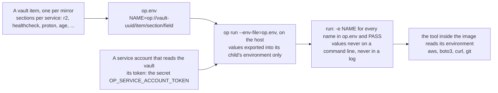

### The vault

One vault. One item per mirror, named for its repository. One section per service in
the item (`r2`, `healthcheck`, `proton`, `age`, `github`, `dropbox`), with the field names
the mirror's README lists. Neither the vault's name nor its UUID is a secret: without the
service account's token it opens nothing.

The references address the vault by UUID, `op://<uuid>/<item>/<section>/<field>`, so a
renamed vault cannot break a run and a name with a slash in it cannot be written:

```sh
op vault get <name> --format json | jq -r .id
```

One service account that can read that vault and nothing else. Its token is the secret
`OP_SERVICE_ACCOUNT_TOKEN`: on an organization, one organization secret that every
repository inherits; on a personal account, one repository secret per mirror. Only a
dispatched sync run holds it; a pull-request check gets no secret at all.

### On the host

`op run --env-file=op.env` resolves every reference and exports the values into the
environment of the one command it wraps, `task run -- ...`, masking each value in that
command's output. On a laptop `op` uses the signed-in desktop app; in Actions it uses the
service account token the reusable workflow put in its environment. The vault is read
once per run.

### Into the container

`run` passes `-e NAME` for each name in `op.env` and in the mirror's `PASS`, plus
`HEALTHCHECK_URL`, `GITHUB_STEP_SUMMARY` and `GITHUB_RUN_ID` always. The container engine
copies each named variable from the host's environment; no value is on the command line.
A host variable the pipeline reads and `op.env` does not name arrives empty.

### The names

| Name | Read by | Set by |
|---|---|---|
| `AWS_ACCESS_KEY_ID`, `AWS_SECRET_ACCESS_KEY` | the AWS CLI and boto3 | the `r2` section |
| `AWS_ENDPOINT_URL` | the AWS CLI, in the `rsync` image | the `r2` section's `endpoint` |
| `AWS_ENDPOINT_URL_S3` | boto3, in the `proton` image | the same field, under boto3's name |
| `AWS_REGION` | both | a literal `auto` in the image; R2 has one region, and masking the word `auto` would corrupt output |
| `MIRROR_R2_BUCKET` | the proton engine's `s3` | the `r2` section's `bucket` |
| `MIRROR_AGE_IDENTITY` | the proton engine's `age` | the `age` section |
| `MIRROR_PROTON_DESTINATION`, `_UID` | the proton engine's `destination` | the `proton` section |
| `HEALTHCHECK_URL` | `ping`, `ping-fail` | the `healthcheck` section; optional |
| `MIRROR_*` of a mirror's own | that mirror | a section of its own: `github`, `dropbox` |

### Without a vault

A mirror with no `op.env` runs on its repository secrets: the reusable workflow exports
every inherited secret into the sync step's environment by name, the ones the mirror
lists in `PASS` cross into the container, and the 1Password CLI is not installed at all.
On a laptop, whatever is exported. This is the fallback, not the pattern: it works, and
it puts the values in a second place.

## Storage

Every mirror has one S3-compatible bucket. What it holds depends on the engine.

| Engine | Key | What |
|---|---|---|
| rsync | every upstream path, at the root | The mirror. A public domain serves the bucket |
| rsync | `.state/applied.txt.xz` | The state: what the bucket holds, at upstream's size and mtime |
| rsync, a mirror's own | `.state/indexed.txt.xz`, `index.html` | ctan's record of what its directory pages show; tlnet's landing page, spared by `OWN` |
| proton | `.state/session.tar.age` | The CLI session, encrypted. The only key |
| a pipeline of its own | `.state/state.sqlite.xz.age`, `.state/history/<epoch>-<label>...` | dropbox's state and its dated copies; a lifecycle rule expires the history |

`.state/` is the one reserved prefix, chosen because no upstream in the org has a
dot-prefixed root entry.

### What a bucket needs

- **A bucket**, named in the mirror's `BUCKET` root var (rsync) or the vault's
  `r2/bucket` field (proton).
- **An API token with Object Read & Write scoped to that bucket alone**, so a leaked
  token reaches one bucket. Its id and secret are the `r2` section.
- **The endpoint**, `https://<account-id>.r2.cloudflarestorage.com` on R2, in the `r2`
  section as `endpoint`. Any S3 endpoint works; the engines use nothing R2-specific.
- **A custom domain on the bucket**, for a public mirror, which is `HOST`. The zone in
  front of it is configured by hand and the pipeline never calls its API; each public
  mirror's README lists its rules.

### R2 specifics

R2 bills storage and Class A writes and nothing for egress, which is why it is the
default: a full CTAN mirror is under $2 a month. Things the engines know about it:

- `AWS_REGION=auto` is an `ENV` line in both images.
- R2 rejects the SDK's default checksum headers, so the `proton` image sets
  `AWS_REQUEST_CHECKSUM_CALCULATION` and `AWS_RESPONSE_CHECKSUM_VALIDATION` to
  `when_required`.
- R2 does not list keys in byte order, so every bucket listing is re-sorted before
  `join` or `comm`.
- The single-part upload limit is 4.995 GiB; a mirror with a larger file sets
  `multipart_threshold` and `multipart_chunksize` in an `aws.config` the Taskfile names
  through `AWS_CONFIG_FILE`. A multipart upload costs one Class A operation per part.
- `DeleteObjects` takes 1,000 keys per call and is free.

## Monitoring

Three surfaces, all fed by the toolbox.

- **healthchecks.io.** `ping` is the last verb of every pipeline; `ping-fail` runs from
  the failure path. A check on the mirror's schedule, with a grace that covers a queued
  run plus a full one, emails when the grace passes without a ping. Nothing sends
  `/start`, so the grace does not cap a run; pause the check before a first fill. Because
  nothing in a mirror starts a run, the check also watches the scheduler: a cron that
  stops firing looks exactly like a pipeline that stops finishing.
- **The job summary.** `report` appends one table to the Actions job page in three
  layers, the toolbox's rows, the engine's, the mirror's, all counted from `.run/` and
  never from the log, whose lines are dropped silently past a limit. It is the first
  thing to read on a run that succeeded and still looks wrong.
- **katoptra.org.** The site's `status.js` reads each public mirror's healthchecks.io
  JSON badge and its Actions API run list at page load, so the table's Status and Last
  synced cells are live.

On a public repository the run logs are public. A pipeline writes counts and phase lines
there and never a path name, a credential or an account identifier: `op run` masks every
value it resolved, git's and the CLI's stderr go to files under `.run/`, and a failure
names an item by its position in the listing.

## The images

One image per engine, built here, pulled from GHCR by every run. Runs never build and
never touch Docker Hub.

| Variant | Base | Tools | For |
|---|---|---|---|
| `rsync` | ubuntu 24.04 | rsync, gnupg, xz, curl, perl (shasum), go-task, AWS CLI v2 trimmed to s3 and sts | rsync upstreams into a bucket: ctan, tlnet |
| `proton` | python 3.13 slim | proton-drive, age, git, go-task, boto3, requests, pytest, ruff, and `s3`, a boto3 get/put | Proton Drive sinks: github through the proton engine, dropbox through its own Python |

Both bind-mount the repository at `/work`, set `TASK_REMOTE_OFFLINE=1` and
`AWS_REGION=auto`, pin their base by digest, and end with a stage that asserts each tool
reports the locked version.

### The lock

`toolchain.lock.toml` is one file for the family: each tool's version and, per
architecture, its archive and checksum. `docker/lock.py` is the one reader the
Dockerfiles and the toolbox action share. Every tool is checked before it is used. The
AWS CLI is the exception that proves it: upstream publishes no checksum, only a detached
PGP signature, so the fetch stage verifies the signature against `docker/aws-cli.pub`
and requires the fingerprint the lock pins, through the same GOODSIG-and-VALIDSIG gate
the engine uses for TeX Live. `docker/gpg-gate-check.sh` proves that gate rejects what it
should, on every CI run.

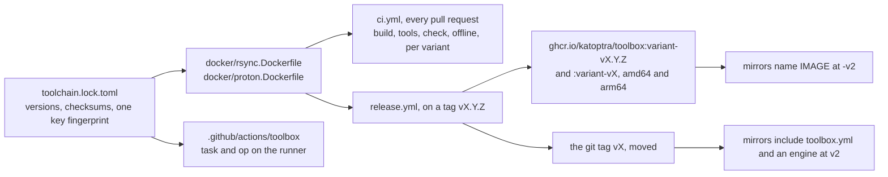

Two pins, one policy. The include and the image float at `v2`, on purpose: moving that
tag is how a verb or a tool reaches every mirror on its next run. The workflow calls are
pinned to a release commit, because an Actions policy that requires a full SHA on every
`uses:` demands it, and Dependabot bumps them. A breaking change to a verb's name or
contract is a new major.

## The workflows

Two reusable workflows and one composite action. A mirror's callers are a few lines each.

### `sync.yml`

One mirror, one run. The caller is a `workflow_dispatch` that a scheduler triggers; it
passes `vars` through and inherits its repository secrets.

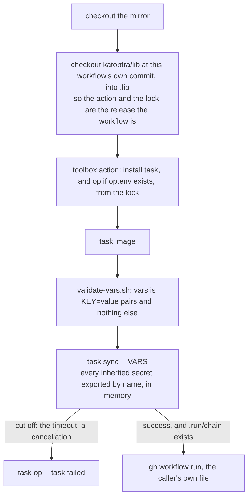

- **Inputs.** `vars`, a string of `KEY=value` pairs for the pipeline inside the image;
  `timeout-minutes`, default 355, under the six-hour job limit. The caller sets
  `timeout-minutes` in `with:` only when it differs.
- **The vars guard.** The shell splits `vars` into words and each becomes a task
  variable an engine may splice into a command, so a word that is not an upper-case key
  and a plain value is refused in a step that holds no secrets. `validate-vars.sh
  --check` runs the guard's own cases in CI.
- **Concurrency.** The caller sets `concurrency: {group: sync, cancel-in-progress:
  false}`, so a dispatch that arrives during a run waits for it; one pending run per
  group, the rest dropped, and the next run's delta subsumes any it displaced.
- **The chain.** When the pipeline left `.run/chain`, the workflow dispatches the
  caller's own file again. This is how an empty bucket fills and a budgeted run
  continues. It is the only reason the caller grants `actions: write`, which a called
  workflow cannot raise for itself.
- **The image.** Nothing caches it across jobs; each job pulls it from GHCR once, before
  the pipeline, and `image`'s `status` guard means one pull serves every `task run` in
  the job. A failure at `task image` is the pull, not the mirror.

### `check.yml`

On every pull request: checkout, lib at the same commit, the toolbox action without
`op`, `task check`. No secret reaches it, so a pull request from a fork runs it safely. A
mirror with more to check (an `offline` verb, a test suite) writes its own `check.yml`
with the toolbox action and its own steps, as github and dropbox do.

### The toolbox action

`.github/actions/toolbox` installs go-task and, unless `op: 'false'`, the 1Password CLI
on the runner, at the versions and checksums in the lock. It is what makes a runner able
to run `task sync`; everything else runs inside the image.

## Using it in a mirror

A mirror repository holds seven things:

```
Taskfile.yml                  root vars, the two includes, the hooks it fills
.taskrc.yml                   trusts raw.githubusercontent.com, refetches at most hourly
op.env                        op:// references, one per secret
render.txt                    the committed dry run
.github/workflows/sync.yml    calls katoptra/lib/.github/workflows/sync.yml at a release commit
.github/workflows/check.yml   calls katoptra/lib/.github/workflows/check.yml at a release commit
.github/dependabot.yml        bumps the two calls on a lib release
```

### An rsync mirror

```yaml
# Taskfile.yml
version: '3'
vars:
  SOURCE: rsync://rsync.dante.ctan.org/CTAN/
  BUCKET: ctan
  HOST: ctan.katoptra.org
includes:
  toolbox:
    taskfile: https://raw.githubusercontent.com/katoptra/lib/v2/toolbox.yml
    flatten: true
    excludes: [report-engine]
    vars:
      NAME: ctan
      DESC: an hourly mirror of CTAN at https://ctan.katoptra.org/
      IMAGE: ghcr.io/katoptra/toolbox:rsync-v2
  rsync:
    taskfile: https://raw.githubusercontent.com/katoptra/lib/v2/engines/rsync.yml
    flatten: true
```

```sh
# op.env
AWS_ACCESS_KEY_ID=op://<vault-uuid>/ctan/r2/access_key_id
AWS_SECRET_ACCESS_KEY=op://<vault-uuid>/ctan/r2/secret_access_key
AWS_ENDPOINT_URL=op://<vault-uuid>/ctan/r2/endpoint
HEALTHCHECK_URL=op://<vault-uuid>/ctan/healthcheck/url
```

That is a whole mirror: the engine supplies `pipeline` and `plan-pipeline`, and
`report-engine` is excluded on the toolbox include because the engine defines it too.

A mirror of one signed subtree, shaped like tlnet, adds `TL`, `TL_KEY`, `CEILING_GB`,
`OWN` and a `FILTER` to the root vars, excludes `index` on the engine include, and
defines an `index` that uploads its landing page and a `report-mirror` with its row.

### A proton mirror

```yaml
version: '3'
vars:
  OWNERS: jshvn katoptra
includes:
  toolbox:
    taskfile: https://raw.githubusercontent.com/katoptra/lib/v2/toolbox.yml
    flatten: true
    excludes: [report-engine, report-mirror]
    vars: {NAME: github, DESC: a nightly mirror of every repository under OWNERS into Proton Drive, IMAGE: ghcr.io/katoptra/toolbox:proton-v2}
  proton:
    taskfile: https://raw.githubusercontent.com/katoptra/lib/v2/engines/proton.yml
    flatten: true
    excludes: [stage, prune]
tasks:
  stage: {cmds: ['# list the repositories, clone each as a mirror, bundle it under {{.STAGING}}/<owner>/']}
  prune: {cmds: ['# list-folder each owner in Proton; trash the bundles no repository has']}
  report-mirror: {cmds: ['# the mirror rows']}
```

Its `op.env` carries the seven names under [The proton engine](#the-proton-engine),
`HEALTHCHECK_URL`, and the mirror's own.

### A toolbox-only mirror

```yaml
version: '3'
includes:
  toolbox:
    taskfile: https://raw.githubusercontent.com/katoptra/lib/v2/toolbox.yml
    flatten: true
    excludes: [report-mirror]
    vars: {NAME: dropbox, DESC: nightly Dropbox -> Proton Drive mirror, IMAGE: ghcr.io/katoptra/toolbox:proton-v2, PASS: MIRROR_VERBOSE}
tasks:
  pipeline:
    cmds: [{task: clock}, {task: session}, {task: state}, '# the mirror's own steps', {task: report}, {task: ping}]
  plan-pipeline:
    cmds: [{task: clock}, {task: session}, {task: state}, '# the read-only steps']
  report-mirror: {cmds: ['# cat the mirror's own report onto the job page']}
```

### The other five files

```yaml
# .taskrc.yml
remote:
  trusted-hosts: [raw.githubusercontent.com]
  cache-expiry: 1h
```

```yaml
# .github/workflows/sync.yml
name: sync
on:
  workflow_dispatch:
    inputs: {vars: {type: string, default: ''}}
permissions: {contents: read, actions: write}   # the chain step; a called workflow cannot raise this
concurrency: {group: sync, cancel-in-progress: false}
jobs:
  sync:
    uses: katoptra/lib/.github/workflows/sync.yml@81fb6ee34abc7703087cfe4a303263febc912c6f # v2.0.0
    with: {vars: '${{ inputs.vars }}'}
    secrets: inherit
```

```yaml
# .github/workflows/check.yml
name: check
on: {pull_request: {}}
permissions: {contents: read}
jobs:
  check:
    uses: katoptra/lib/.github/workflows/check.yml@81fb6ee34abc7703087cfe4a303263febc912c6f # v2.0.0
```

```yaml
# .github/dependabot.yml
version: 2
updates:
  - package-ecosystem: github-actions
    directory: /
    schedule: {interval: weekly}
    groups: {actions: {patterns: ['*']}}
```

Then `task render-update` once, commit `render.txt`, and `task check` from then on.
Every pull request that changes what the mirror executes shows up as a diff in
`render.txt`, and that diff is the review.

### Rules a mirror keeps

- **Root vars are the identity and nothing else.** A root var that restates an engine
  default silences the command line for it.
- **A called task sees none of its caller's call vars**, and a root var cannot read an
  include's var. A hook a verb calls with an overridable `RUN` or `STAGING` gets them
  passed on explicitly, as `smoke` does.
- **No `dir:` on a verb an include defines.** In a flattened include read by path, task
  joins even an absolute `dir:` onto the include's directory; `verify` starts each
  command with `cd` instead.
- **`render` mounts an empty directory over `.run`**, so a `sh:` var read from it at
  parse time renders the same from any working tree. A verb that reads `.run` at parse
  time must tolerate an empty one.
- **`task run -- task <x>` exits 201 for any inner failure.** A test can assert
  "nonzero" and nothing more specific.

## Changing it

### Overriding a verb, in a mirror

List it under `excludes:` on the include that defines it and define it in the mirror. A
duplicate without `excludes` is a parse error, on purpose.

```yaml
includes:
  rsync:
    taskfile: https://raw.githubusercontent.com/katoptra/lib/v2/engines/rsync.yml
    flatten: true
    excludes: [index]          # the mirror draws its own landing page
tasks:
  index:
    cmds: [...]
```

The rules that keep this honest:

- Keep the name and the meaning. A `verify` that does something other than verify is a
  new verb with its own name, listed in `MENU`.
- Extend through a hook, never a copy. A mirror that needs the engine's `smoke` and
  more defines `smoke-mirror`, which `smoke` runs last, rather than excluding `smoke`
  and pasting it: the copy stops following releases the day it is made.
- The replacement reads the mirror's root vars, the same as the original did.
- Override engine verbs and the in-container toolbox verbs. Do not override the host
  side: `sync`, `plan`, `check` and `run` are what the workflows and the menu promise.
- `report-engine` is defined in the toolbox as a no-op and in every engine, so an engine
  consumer's toolbox include excludes it.

### Adding a hook or a verb, in an engine

A change to how bytes move or how a tree is verified goes to the engine, where every
mirror gets it. If two mirrors would copy a verb, the verb belongs here. A new hook is an
empty task with a `desc` that says who fills it, called from the verb that runs it with
the vars it needs passed on. A new tunable is an inline `{{.X | default N}}` in the
command that reads it, spelled once, and a row in the vars table above. A change to a
verb is a change to `examples/<variant>/render.txt`, and the pull request diff of that
file is the review.

### Plugging in an engine

One engine per transport, one image variant per engine. Adding one is five files and
two matrix entries:

1. **Tools**: each tool's version and per-arch checksum in `toolchain.lock.toml`.
2. **Image**: `docker/<variant>.Dockerfile`, base pinned by digest, every tool from the
   lock, `TASK_REMOTE_OFFLINE=1`, and a final stage that asserts each tool reports the
   locked version. `docker/rsync.Dockerfile` is the model.
3. **Verbs**: `engines/<variant>.yml` with the pipeline vocabulary, `clock` first and
   `report`, `ping` last. No `vars:` default for anything a mirror owns.
4. **Example**: `examples/<variant>/` with a Taskfile whose `pipeline` is every verb, a
   committed `render.txt`, and an `offline` verb that runs the ones that need no bucket
   over `fixtures/`. This is the engine's own check.
5. **CI**: the variant in the `matrix` of `ci.yml` and `release.yml`.

An HTTPS engine would be the same base as `rsync`, curl and the AWS CLI, and a `list`
that reads an index instead of `rsync --list-only`.

### Bumping a tool

Change its version and every checksum beneath it in `toolchain.lock.toml`; the
Dockerfile's final stage fails the build if a tool does not report the new version. The
AWS CLI's signing key expires 2027-07-01; refresh `docker/aws-cli.pub` and the
fingerprint from the AWS CLI User Guide before then. The Proton CLI's session format is
tied to its version: bumping it means a fresh laptop login and `session-seal` for every
Proton mirror.

### Releasing

Tag a commit `vX.Y.Z` and push the tag. The release workflow builds both images for
amd64 and arm64, pushes `<variant>-vX.Y.Z` and `<variant>-vX`, and moves the `vX` git
tag. Every mirror pinned to `vX` picks the change up on its next run; the workflow
callers follow through Dependabot. A breaking change to a verb's name or contract is a
new major, and every mirror moves its two `v2` strings by hand.

## Working on it

```sh
git clone https://github.com/katoptra/lib
cd lib/examples/rsync  && task image-build && task run -- task tools && task check && task run -- task offline
cd ../proton           && task image-build && task run -- task tools && task check && task run -- task offline
```

`task image-build` builds the image the example names from `docker/`. `task run -- task
tools` asks every tool for its version. `task check` renders the example's pipeline
inside the image and diffs it against `render.txt`. `task run -- task offline` runs the
engine's verbs that need no bucket over `fixtures/`: for rsync, the list diff, `retry`,
and `prepare` and `verify` over a signed subtree whose throwaway key is pinned in the
example; for proton, `confirm` over an accepting and a refusing upload summary, and an
`age` round trip. CI runs the same four steps per variant on every pull request, plus
the two guards' own cases.

Change a verb, run `task render-update` in each example, and the diff in the pull
request is the review. `CONTRIBUTING.md` has the three rules this repository adds to the
org's.

## Recreating it from nothing

What a person with none of this would need, in the order it has to happen. Everything
below is a one-time action by hand; nothing in a repository does it.

1. **Accounts.** A GitHub organization (or a personal account; the difference is where
   the one secret lives). A Cloudflare account with R2, and a zone for each public
   mirror's domain. A 1Password account with a service account. A healthchecks.io
   account.
2. **The images.** Use `ghcr.io/katoptra/toolbox` as is; the packages are public. Or fork
   this repository and push a tag `v1.0.0`: `release.yml` builds and pushes the images to
   your GHCR under the repository's own token, and you make the packages public once.
   Then every mirror's `IMAGE` and include URL name your fork.
3. **The vault.** One vault; note its UUID. One service account that reads it. Its token
   as the organization secret `OP_SERVICE_ACCOUNT_TOKEN`.
4. **Actions policy.** Allow GitHub-owned actions, `go-task/*`, and the organization's
   own; require a full SHA on every `uses:`. Dependabot handles the bumps.
5. **A mirror.** Fork one. Edit its identity vars. Make its bucket, its token scoped to
   the bucket, and, for a public mirror, its custom domain and zone rules. Make its vault
   item with the sections its README lists. Put the vault UUID in `op.env`. `task check`,
   then Actions, sync, Run workflow. Make its healthcheck and put the URL in the item.
6. **A schedule.** A `schedule:` trigger in the mirror's `sync.yml`, or an external
   dispatcher. GitHub disables a scheduled workflow on a repository with no activity for
   60 days, which is why the katoptra mirrors are dispatched from outside.
7. **The site.** Optional: fork katoptra/site, one entry per mirror in
   `data/mirrors.toml`, deploy anywhere static.

Pull requests are welcome.

MIT licensed. Built by [Josh Vaughen](https://ijosh.com).
