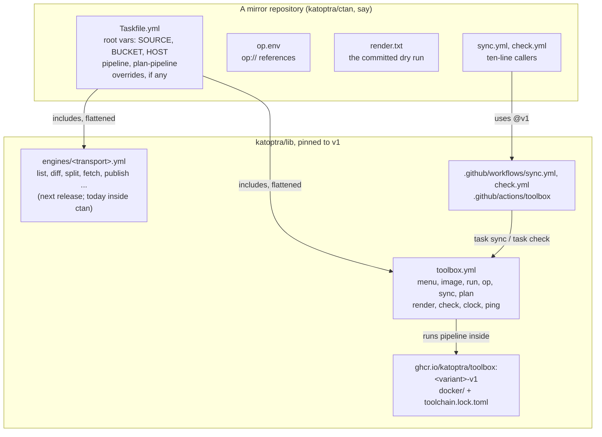
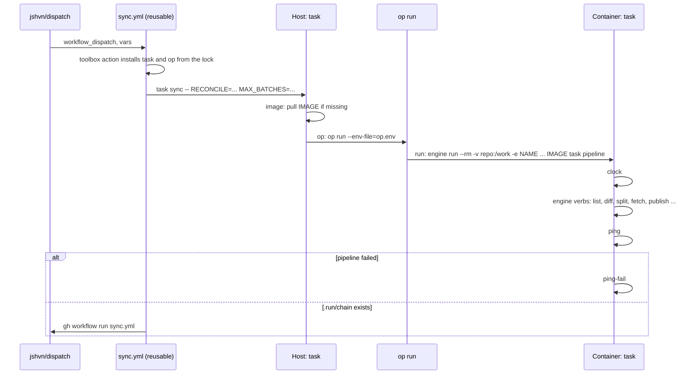

# lib

[](https://github.com/katoptra/lib/actions/workflows/ci.yml)
[](LICENSE)

The toolbox every katoptra mirror includes by URL. The rule it enforces: the code that
starts a run, contains it, resolves its secrets, checks it and reports it lives here,
once. The code that moves bytes for a transport belongs here too, once per engine, and
the first engine lands in the next release. A mirror holds only its identity, the order
of its pipeline, and the few verbs no other mirror shares.

## The layers



| Layer | Lives in | Owns | A mirror touches it when |
|---|---|---|---|
| Toolbox | `toolbox.yml` | How a run starts, is contained, resolves secrets, is rendered, checked and reported | Never; it is included as is |
| Engine | `engines/<transport>.yml` | How bytes move for one transport: rsync to R2, Proton Drive, HTTPS | It lists a verb under `excludes:` and defines its own |
| Image | `docker/`, `toolchain.lock.toml` | Every tool a run needs, pinned by checksum | Never; it names one in `IMAGE` |
| Workflows | `.github/workflows`, `.github/actions/toolbox` | How Actions installs the tools and runs `task sync` and `task check` | Never; its callers are ten lines |
| Mirror | The mirror's own repository | Identity, pipeline order, the exceptions | Always; this is all it holds |

## What a run looks like

The same path on a laptop and in Actions. On a laptop it starts at `task sync`.



Three things the diagram hides:

- **Secrets cross by name, never by value.** `op run` resolves `op.env` on the host and
  exports the values; `run` passes `-e NAME` for each name in `op.env` and in `PASS`,
  plus `HEALTHCHECK_URL`, `GITHUB_STEP_SUMMARY` and `GITHUB_RUN_ID` always, so no value
  ever appears on a command line or in a log.
- **1Password is read once per run.** One `op run` wraps the whole pipeline, and the
  fail ping runs inside the same container, so a failed run costs no second read. A
  mirror without an `op.env` runs on its repository secrets: the reusable workflow
  exports every inherited secret into the sync step's environment by name, and the ones
  the mirror lists in `PASS` cross into the container.
- **Nothing inside the container reaches the network for task itself.** The image sets
  `TASK_REMOTE_OFFLINE=1` and the mirror's `.task/remote` cache rides in with the repo.
- **`plan` is `sync` with the read-only half.** It runs `plan-pipeline` instead of
  `pipeline`, inside the same image with the same secrets.

## The verbs

### What a mirror must define

| Name | Kind | Meaning |
|---|---|---|
| `pipeline` | task | The full run, in order, inside the image. `sync` calls it. |
| `plan-pipeline` | task | The read-only half, inside the image. `plan` calls it. |
| `SOURCE`, `BUCKET`, `HOST` | root vars | The mirror's identity. Engines read them; the library never defaults them. |
| `NAME`, `DESC`, `IMAGE` | include vars | The menu's title and line, and the image the run happens inside. |

### What a mirror may define

| Name | Kind | Meaning |
|---|---|---|
| `PASS` | include var | Host environment names that cross into the container beside the ones in `op.env`, for a pipeline that reads its environment. Task vars are not environment: they go after `--`, as `task sync -- MAX_BATCHES=8`. |
| `MENU` | include var | Extra lines for the menu, one per mirror-specific verb. |
| `LIB_DIR` | include var | Where `image-build` finds `docker/`; defaults to `../lib`. |
| `op.env` | file | `op://` references, one per secret. Absent means the environment is already resolved: on a laptop, whatever is exported; in Actions, the repository's secrets, crossing by the names in `PASS`. |
| `excludes:` | include key | Library verbs the mirror replaces. See below. |

### What the toolbox provides

Host side, and the mirror does not override these. They are the contract the workflows
call and the menu documents.

| Verb | Does |
|---|---|
| `default` | The grouped menu, from `NAME`, `DESC` and `MENU` |
| `sync` | `op -- task pipeline`: one run |
| `plan` | `op -- task plan-pipeline`: the read-only half |
| `check` | `render`, then diff against `render.txt` |
| `render-update` | `render`, then accept it as `render.txt` |
| `render` | `task --dry --force pipeline` inside the image, saved to `.run/render.txt` |
| `run -- <cmd>` | Anything inside the image, with the repo at `/work` |
| `op -- <cmd>` | `run`, wrapped in `op run --env-file=op.env` when the file exists |
| `image` | Pull `IMAGE`; a no-op while it exists locally |
| `image-build` | Build `IMAGE` from `LIB_DIR/docker/<variant>.Dockerfile` |
| `image-clean` | Remove `IMAGE` |
| `clean` | Delete every ignored file |

Inside the image. A mirror or engine may override these when it keeps its own.

| Verb | Does |
|---|---|
| `clock` | Write "epoch UTC-hour weekday" to `.run/start.txt` |
| `ping` | GET `HEALTHCHECK_URL`; skipped when unset |
| `ping-fail` | GET `HEALTHCHECK_URL/fail`; skipped when unset |

### What an engine provides

An engine is a second include with the verbs for one transport. Its verbs are the
pipeline vocabulary, reserved across every engine so a mirror's `pipeline` reads the
same whichever transport it uses:

`list`, `state`, `diff`, `split`, `prepare`, `batches`, `fetch`, `verify`, `publish`,
`checkpoint`, `delete`, `reconcile`, `index`, `smoke`, `report`

Three of them, `prepare`, `verify` and `index`, are hooks: the engine ships them as
no-ops, and a mirror that needs them overrides them. CTAN verifies signatures in
`verify`; a mirror with a landing page builds it in `index`.

The rsync engine is the first. Its verbs live in [katoptra/ctan](https://github.com/katoptra/ctan)
today and move to `engines/rsync.yml` in the next release, once ctan and tlnet both
consume the toolbox. Until then a mirror carries its engine verbs in its own Taskfile.

### The bucket is the mirror; the state is a cache

An rsync engine keeps a state file in the bucket, under `.state/`, listing every key the
bucket holds at upstream's size and mtime. Each run diffs upstream's listing against it,
so an hourly run costs one listing of upstream and none of the bucket. Two things follow.

- **There is no seed.** A missing state file is rebuilt from a listing of the bucket. An
  empty bucket gives an empty state, so the first run's delta is the whole tree, worked
  `MAX_BATCHES` at a time; when batches remain the run chains the next one, and the fill
  converges in a few chained runs with no flag. A lost state file costs the same listing
  and nothing else.
- **`RECONCILE` is the check on a live mirror.** It rebuilds the state from the bucket
  on purpose, daily by default, and deletes keys neither upstream nor the state owns.

What a mirror cannot afford to lose is the bucket. Everything else, the state file and the
staging tree included, is derived from it and from upstream.

## Overriding a verb

List it under `excludes:` on the include and define it in the mirror. A duplicate
without `excludes` is a parse error, on purpose.

```yaml
includes:
  toolbox:
    taskfile: https://raw.githubusercontent.com/katoptra/lib/v1/toolbox.yml
    flatten: true
    excludes: [clock]          # a Python engine keeps its own clock
    vars: {NAME: photos, DESC: ..., IMAGE: ghcr.io/katoptra/toolbox:proton-v1}
tasks:
  clock:
    cmds: [python -c 'import time; print(int(time.time()))']
```

The rules that keep this honest:

- Keep the name and the meaning. A `verify` that does something other than verify is a
  new verb with its own name, listed in `MENU`.
- The replacement reads the mirror's root vars, the same as the original did.
- Override engine verbs and the in-container toolbox verbs. Do not override the host
  side: `sync`, `plan`, `check` and `run` are what the workflows and the menu promise.
- Everything the mirror does not exclude comes from here, and a release changes it.

## Plugging in an engine

One engine per transport, one image variant per engine. Adding one is five files and
two matrix entries:

1. **Tools**: add each tool's version and per-arch checksum to `toolchain.lock.toml`.
2. **Image**: `docker/<variant>.Dockerfile`, base pinned by digest, every tool installed
   from the lock, `TASK_REMOTE_OFFLINE=1`, and a final stage that asserts each tool
   reports the locked version. `docker/rsync.Dockerfile` is the model.
3. **Verbs**: `engines/<variant>.yml` with the pipeline vocabulary above. No `vars:`
   default for anything a mirror owns; defaults go inline as `{{.X | default N}}`.
4. **Example**: `examples/<variant>/` with a Taskfile that exercises every verb offline
   and a committed `render.txt`. This is the engine's own check.
5. **CI**: add the variant to the `matrix` in `ci.yml` and `release.yml`.

| Variant | Base | Tools | For |
|---|---|---|---|
| `rsync` | ubuntu 24.04 | rsync, gnupg, xz, curl, perl, go-task, AWS CLI v2 (s3, sts) | rsync upstreams to R2: ctan, tlnet, cran, cpan |
| `proton` | python 3.13 slim | proton-drive, age, go-task, boto3, requests, pytest, ruff | Python pipelines: dropbox, photos |

An HTTPS engine would be a third row: the same base as `rsync`, curl and the AWS CLI,
and a `list` that reads an index instead of `rsync --list-only`.

## Using it in a mirror

A mirror repository holds six things:

```
Taskfile.yml                  root vars, the two includes, pipeline, plan-pipeline, overrides
.taskrc.yml                   trusts raw.githubusercontent.com, refetches at most hourly
op.env                        op:// references only (optional)
render.txt                    the committed dry run
.github/workflows/sync.yml    calls katoptra/lib/.github/workflows/sync.yml@v1
.github/workflows/check.yml   calls katoptra/lib/.github/workflows/check.yml@v1
```

```yaml
# Taskfile.yml
version: '3'
vars:
  SOURCE: rsync://rsync.dante.ctan.org/CTAN/
  BUCKET: ctan
  HOST: ctan.ijosh.com
includes:
  toolbox:
    taskfile: https://raw.githubusercontent.com/katoptra/lib/v1/toolbox.yml
    flatten: true
    vars:
      NAME: ctan
      DESC: an hourly mirror of CTAN at https://ctan.ijosh.com/
      IMAGE: ghcr.io/katoptra/toolbox:rsync-v1
tasks:
  pipeline:      {cmds: [{task: clock}, {task: list}, {task: ping}]}
  plan-pipeline: {cmds: [{task: clock}, {task: list}]}
  list:          {cmds: ['rsync --list-only {{.SOURCE}} > {{.RUN}}/listing.txt']}
```

Until the rsync engine ships, `list` and the other pipeline verbs live in the mirror,
as above. After it, a second include replaces them and `list:` goes away.

```yaml
# .taskrc.yml
remote:
  trusted-hosts: [raw.githubusercontent.com]
  expiry: 1h
```

```yaml
# .github/workflows/sync.yml
name: sync
on:
  workflow_dispatch:
    inputs: {vars: {type: string, default: ''}}
permissions: {contents: read, actions: write}   # the chain step; a called workflow cannot raise this
concurrency: {group: sync, cancel-in-progress: false}
jobs:
  sync:
    uses: katoptra/lib/.github/workflows/sync.yml@v1
    with: {vars: '${{ inputs.vars }}'}
    secrets: inherit
```

```yaml
# .github/workflows/check.yml
name: check
on: {pull_request: {}}
jobs:
  check:
    uses: katoptra/lib/.github/workflows/check.yml@v1
```

Then `task render-update` once, commit `render.txt`, and `task check` from then on.
Every pull request that changes what the mirror executes shows up as a diff in
`render.txt`, and that diff is the review.

## Working on it

```sh
$ git clone https://github.com/katoptra/lib
$ cd lib/examples/rsync && task image-build && task check
$ cd ../proton && task image-build && task check
```

`task image-build` builds the image the example names from `docker/`. `task check`
renders the example's pipeline inside it and diffs against `render.txt`. Change a verb,
run `task render-update` in each example, and the diff in the pull request is the
review. `CONTRIBUTING.md` has the three rules this repository adds to the org's.

## Releasing

Tag a commit `vX.Y.Z` and push the tag. The release workflow builds both images for
amd64 and arm64, pushes `<variant>-vX.Y.Z` and `<variant>-vX`, and moves the `vX` git
tag. Every mirror pinned to `vX` picks the change up on its next run. A breaking change
to a verb's name or contract is a new major.

Pull requests are welcome.

MIT licensed. Built by [Josh Vaughen](https://ijosh.com).
