<p align="center">
  <a href="https://github.com/katoptra">
    <picture>
      <source media="(prefers-color-scheme: dark)" srcset="https://katoptra.org/brand/katoptra-mark-dark-224.png">
      
    </picture>
  </a>
</p>

<h1 align="center">lib</h1>

<p align="center">The toolbox that all katoptra mirrors include from a URL.</p>

<p align="center">
  <a href="https://github.com/katoptra/lib/actions/workflows/ci.yml"></a>
  <a href="LICENSE"></a>
</p>

This repository has one rule: the code that all mirrors use is here, one time. This code
does these tasks:

- It starts each run in a container.
- It gets the secrets of the run.
- It does a check of the pipeline, and it gives a report of each run.
- It moves the bytes. Each transport has one engine here:
  - `engines/rsync.yml` copies an rsync upstream into a bucket.
  - `engines/proton.yml` copies a staging tree into Proton Drive.

A mirror contains only its identity, the hooks that it fills, and the verbs that no other
mirror uses.

This file is the manual. The README of a mirror gives the upstream that the mirror copies,
and the steps to fork it. For each part that all mirrors use, it has a link to this file.
Read this file one time, from the start to the end. This gives you the full system. After
that, you can read each section without the other sections.

## The system in one diagram

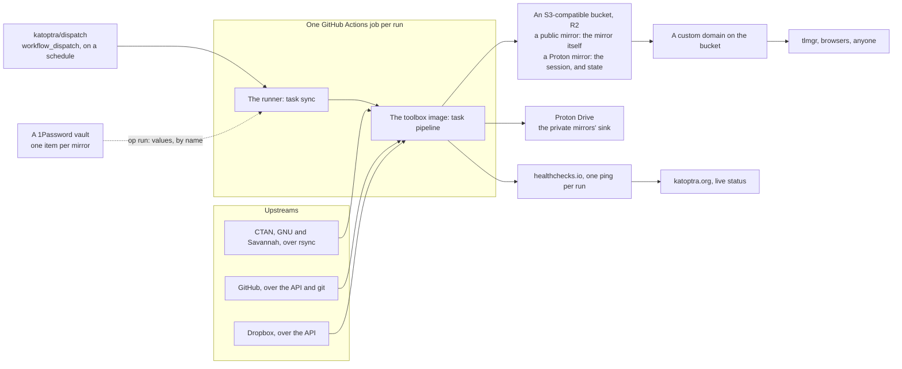
```mermaid
flowchart LR
  subgraph up["Upstreams"]
    u1["CTAN, GNU and Savannah, over rsync"]
    u2["GitHub, over the API and git"]
    u3["Dropbox, over the API"]
  end
  sched["katoptra/dispatch<br/>workflow_dispatch, on a schedule"] --> host
  subgraph job["One GitHub Actions job per run"]
    host["The runner: task sync"] --> box["The toolbox image: task pipeline"]
  end
  vault["A 1Password vault<br/>one item per mirror"] -. "op run: values, by name" .-> host
  u1 --> box
  u2 --> box
  u3 --> box
  box --> r2["An S3-compatible bucket, R2<br/>a public mirror: the mirror itself<br/>a Proton mirror: the session, and state"]
  box --> pd["Proton Drive<br/>the private mirrors' sink"]
  r2 --> cf["A custom domain on the bucket"] --> cl["tlmgr, browsers, anyone"]
  box --> hc["healthchecks.io, one ping per run"] --> site["katoptra.org, live status"]
```

Each mirror has the structure of this diagram, with one upstream and one sink. There are two
types of mirror:

- A public mirror (ctan, tlnet, gnu and nongnu) copies an rsync tree into a bucket, and a
  domain serves the bucket. The bucket is the mirror.
- A private mirror (github and dropbox) copies an account into Proton Drive. Its bucket
  contains only the data that the next run uses.

The two types of mirror do a run with the same steps:

1. The scheduler starts a job on GitHub Actions.
2. The job downloads one image.
3. The job gets the secrets of the mirror from a vault, with the name of each secret.
4. The job runs `task pipeline` in the image.

The same command runs on a laptop.

## The layers

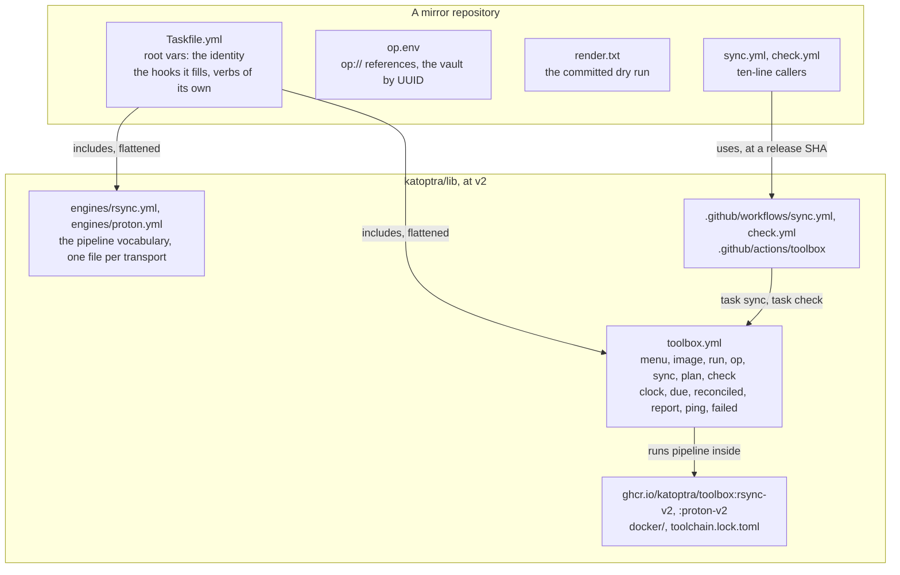
```mermaid
flowchart TB
  subgraph mirror["A mirror repository"]
    tf["Taskfile.yml<br/>root vars: the identity<br/>the hooks it fills, verbs of its own"]
    opv["op.env<br/>op:// references, the vault by UUID"]
    rt["render.txt<br/>the committed dry run"]
    cw["sync.yml, check.yml<br/>ten-line callers"]
  end
  subgraph lib["katoptra/lib, at v2"]
    tb["toolbox.yml<br/>menu, image, run, op, sync, plan, check<br/>clock, due, reconciled, report, ping, failed"]
    en["engines/rsync.yml, engines/proton.yml<br/>the pipeline vocabulary, one file per transport"]
    im["ghcr.io/katoptra/toolbox:rsync-v2, :proton-v2<br/>docker/, toolchain.lock.toml"]
    wf[".github/workflows/sync.yml, check.yml<br/>.github/actions/toolbox"]
  end
  tf -- "includes, flattened" --> tb
  tf -- "includes, flattened" --> en
  tb -- "runs pipeline inside" --> im
  cw -- "uses, at a release SHA" --> wf
  wf -- "task sync, task check" --> tb
```

| Layer | Location | Contents | Does a mirror change it? |
|---|---|---|---|
| Toolbox | `toolbox.yml` | How a run starts, gets its secrets and stays in its container. The render, the check and the report of a run | No. A mirror includes it with no change |
| Engine | `engines/<transport>.yml` | How bytes move for one transport, and the sequence of the pipeline | Yes, to fill a hook: it puts the hook in `excludes:`, and it writes the hook |
| Image | `docker/`, `toolchain.lock.toml` | All the tools that a run uses. Each tool has a pin: its checksum | No. The engine gives the image, or the mirror gives it in `IMAGE` |
| Workflows | `.github/workflows`, `.github/actions/toolbox` | How Actions installs the tools and runs `task sync` and `task check` | No. Each caller in a mirror has only a small number of lines |
| Mirror | The repository of the mirror | The identity, the hooks, and the verbs that no other mirror uses | Yes, always. These items are all that a mirror contains |

## The steps of a run

A run has the same steps on a laptop and in Actions. On a laptop, the run starts at
`task sync`.

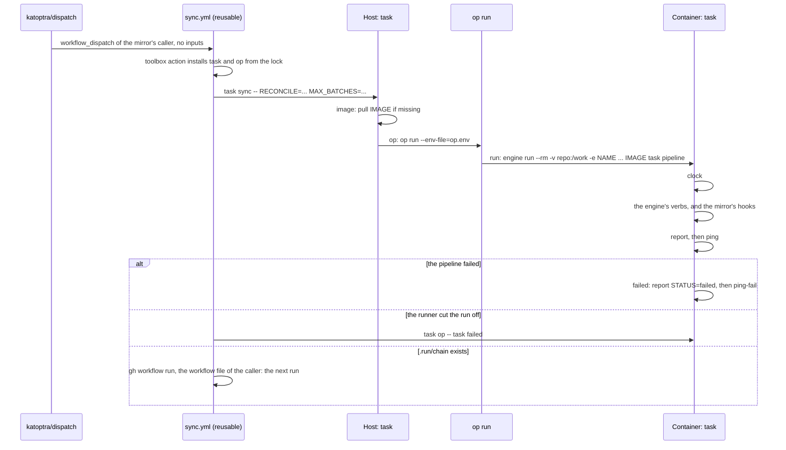
```mermaid
sequenceDiagram
  participant D as katoptra/dispatch
  participant W as sync.yml (reusable)
  participant H as Host: task
  participant O as op run
  participant C as Container: task
  D->>W: workflow_dispatch of the mirror's caller, no inputs
  W->>W: toolbox action installs task and op from the lock
  W->>H: task sync -- RECONCILE=... MAX_BATCHES=...
  H->>H: image: pull IMAGE if missing
  H->>O: op: op run --env-file=op.env
  O->>C: run: engine run --rm -v repo:/work -e NAME ... IMAGE task pipeline
  C->>C: clock
  C->>C: the engine's verbs, and the mirror's hooks
  C->>C: report, then ping
  alt the pipeline failed
    C->>C: failed: report STATUS=failed, then ping-fail
  else the runner cut the run off
    W->>C: task op -- task failed
  else .run/chain exists
    W->>W: gh workflow run, the workflow file of the caller: the next run
  end
```

The diagram does not show these four items:

- **Secrets go into the container with their names, not with their values.** On the host,
  `op run` gets the value of each reference in `op.env`, and it exports the values. For
  each name in `op.env` and in `PASS`, `run` gives `-e NAME` to the container. It also
  always gives `HEALTHCHECK_URL`, `GITHUB_STEP_SUMMARY` and `GITHUB_RUN_ID`. Thus, no value
  shows on a command line or in a log. [Secrets](#secrets) gives the full path.
- **A run reads the vault one time.** One `op run` command runs all of the pipeline, and
  the failure path, `failed`, runs in the same container. Thus, a run with a failure does
  not read the vault a second time. If the runner stops a run, at the timeout or because a
  person cancels it, the run does not start its failure path. Then the workflow runs
  `failed` again from the host, and this reads the vault one more time. Such a run does
  not occur frequently.
- **In the container, task does not use the network for its Taskfiles.** The image sets
  `TASK_REMOTE_OFFLINE=1`. The `.task/remote` cache of the mirror goes into the container
  with the repository.
- **`plan` is `sync` with only the read-only half.** It runs `plan-pipeline`, not
  `pipeline`, in the same image and with the same secrets.

## The toolbox

`toolbox.yml` contains the verbs that all mirrors have, with all engines. Half of these
verbs run on the host and start the container. The other half run in the container: they
are the first steps and the last steps of each pipeline.

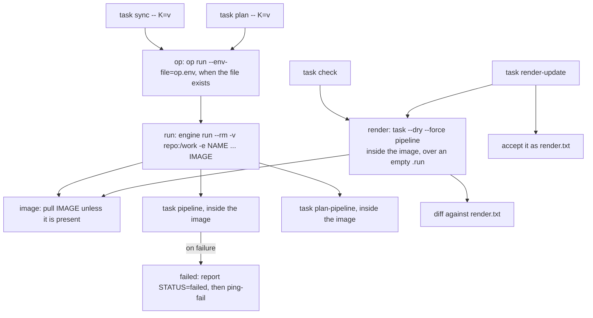
```mermaid
flowchart TB
  sync["task sync -- K=v"] --> op
  plan["task plan -- K=v"] --> op
  op["op: op run --env-file=op.env, when the file exists"] --> run
  run["run: engine run --rm -v repo:/work -e NAME ... IMAGE"] --> image["image: pull IMAGE unless it is present"]
  run --> pipeline["task pipeline, inside the image"]
  run --> pp["task plan-pipeline, inside the image"]
  pipeline -- "on failure" --> failed["failed: report STATUS=failed, then ping-fail"]
  check["task check"] --> render["render: task --dry --force pipeline<br/>inside the image, over an empty .run"]
  render --> image
  render --> d["diff against render.txt"]
  ru["task render-update"] --> render
  ru --> cp["accept it as render.txt"]
```

### Host side

These verbs are the contract that the workflows use and that the menu shows. A mirror does
not override them.

| Verb | Function |
|---|---|
| `default` | Prints the menu in groups, from `NAME`, `DESC` and `MENU` |
| `sync -- [K=v ...]` | `op -- task pipeline`: one run. The words after `--` are task vars for the pipeline in the image |
| `plan -- [K=v ...]` | `op -- task plan-pipeline`: the read-only half |
| `check` | `render`, then a diff with `render.txt` |
| `render-update` | `render`, then it copies the render to `render.txt` |
| `render` | `task --dry --force pipeline` in the image, with an empty `.run`. It writes the result to `.run/render.txt`. No secret goes into the container |
| `run -- <cmd>` | Runs a command in the image, with the repository at `/work` |
| `op -- <cmd>` | `run`, in `op run --env-file=op.env` if the repository has `op.env` |
| `image` | Downloads `IMAGE`. While the host has the image, it does not download it again |
| `image-build` | Builds `IMAGE` from `LIB_DIR/docker/<variant>.Dockerfile`. The default `LIB_DIR` is `../lib` |
| `image-clean` | Removes `IMAGE` |
| `clean` | Deletes `.run`, `staging` and the Taskfile cache, and no other file |

The container runtime (`ENGINE`) is Apple `container` when its daemon operates. If not, it
is Docker. `ENGINE=docker` selects Docker. A host has only these tools:

- go-task
- The container runtime
- The 1Password CLI, for a task that reads the vault.

### In the image

These verbs are the first verbs and the last verbs of each pipeline. A mirror or an engine
can override one of them with a verb of the same name.

| Verb | Function |
|---|---|
| `clock` | Writes the start epoch of the run to `.run/start.txt`. It deletes the chain file and the `.run/reconcile` of the last run |
| `due` | Finds if this run does a reconcile, from the time of the last reconcile in `.state/reconciled`. If it does, `due` writes `.run/reconcile`. `due-rule` is the rule, and it does not download the file |
| `reconciled` | Records the start of this run in `.state/reconciled`. An engine runs it when it completes a reconcile |
| `report` | Adds the run summary to the job page in Actions. If it does not run in Actions, it writes the summary to stdout. The report has the rows of the toolbox first, then the rows of `report-engine`, then the rows of `report-mirror` |
| `report-mirror` | A hook, empty here, for the rows of the mirror |
| `ping` | Sends a GET to `HEALTHCHECK_URL`. If `HEALTHCHECK_URL` is empty, it sends no request |
| `ping-fail` | Sends a GET to `HEALTHCHECK_URL/fail`. If `HEALTHCHECK_URL` is empty, it sends no request |
| `failed` | The failure path: `report STATUS=failed`, then `ping-fail` |

`sync` runs `pipeline` in one container. If the pipeline has a failure, `sync` runs
`failed` in the same container. The report is one table with three layers. Each row is a
`| Label | value |` line that `report` adds to the same file. The rows are in this
sequence:

1. The rows of the toolbox. They give the start time and the length of the run, and the
   image. They also give the time of the next run: immediately with the chain, or at its
   next slot.
2. The rows of the engine
3. The rows of the mirror.

Each row operates if a file is missing, because the report also runs after a pipeline with
a failure.

#### When a reconcile runs

A reconcile compares the mirror with its destination, not with its state. The time of the
last reconcile gives the time of the next one. The start time of a run does not give it,
because the scheduler is not in the mirror, and its times can change. A pipeline that does a
reconcile runs `due` near its start. Its reconcile step runs only if `.run/reconcile` is
there.

| Var | Default | Function |
|---|---|---|
| `RECONCILE` | `auto` | Each run can set it: `task sync -- RECONCILE=true`. With `true`, the run does a reconcile. With `false`, it does not. With `auto`, it does a reconcile if no run recorded a reconcile. It also does one if the last reconcile occurred `RECONCILE_HOURS` or more before the run |
| `RECONCILE_HOURS` | 24 | The number of full hours between two reconciles. For a different interval, a mirror sets it in its root vars |

`.state/reconciled` contains the start epoch of the run that completed the last reconcile.
The `pull` and `push` of the engine read and write this file. Thus, with the rsync
engine, the file has xz compression, the same as the state.

The limit is half an hour less than `RECONCILE_HOURS`. A daily run starts some seconds
before or after the time that is 24 h after the last run. With a limit of 24 h and no
less, a reconcile occurs only on each second day.

In these conditions, a run records no reconcile, and the reconcile is also necessary at the
next run:

- The run stops with a failure before it completes its reconcile.
- An rsync run has batches that wait for a subsequent run. Its reconcile waits for the
  run of the chain that uploads the last batch.

### The parts that a mirror supplies

| Name | Type | Function |
|---|---|---|
| `NAME`, `DESC` | Vars in `includes:`, necessary | The title and the line of the menu |
| `IMAGE` | Var in `includes:`, necessary if the engine does not give it | The image in which the run operates. If there is a value in `includes:` and also in the engine, the run uses the value in `includes:` |
| `pipeline`, `plan-pipeline` | Tasks, necessary | The full run and its read-only half, in the image. An engine supplies the two tasks. A mirror with no engine, or that puts them in `excludes:`, writes them |
| `report-engine` | Task, necessary | The rows of the engine in the run summary. `report` runs it. An engine supplies it. A mirror with no engine, or that puts it in `excludes:`, writes it, with no commands if it has no rows |
| `op.env` | File | `op://` references, one for each secret. With no `op.env`, the environment has the values before the run starts. On a laptop, these are the exported values. In Actions, the secrets of the caller go into the container with the names in `PASS` |
| `PASS` | Var in `includes:` | The names of host environment variables that go into the container. The names in `op.env` also go into the container. Task vars are not environment variables: they go after `--` |
| `MENU` | Var in `includes:` | More lines for the menu, one for each verb that only this mirror has |
| `report-mirror` | Task | The rows of the mirror in the run summary. The mirror puts it in `excludes:` in the toolbox entry of `includes:` |
| `LIB_DIR` | Var in `includes:` | The location where `image-build` finds `docker/`. The default is `../lib` |
| `RECONCILE_HOURS` | Root var | The hours between two reconciles, if not 24. Refer to [When a reconcile runs](#when-a-reconcile-runs) |
| `pull`, `push` | Tasks | The tasks that `due` and `reconciled` use to read and write `.state/reconciled`. An engine supplies the two tasks |
| `excludes:` | Key in `includes:` | The verbs of lib that the mirror overrides. Refer to [Changing it](#changing-it) |

## The engines

An engine is a second entry in `includes:`, with the verbs for one transport. The names of
these verbs are the same in all engines, and a mirror cannot use these names for a
different verb. Thus, the pipeline of a mirror has the same verbs with each engine.

An engine reads the root vars of the mirror and the environment. It has no `vars:` default
for a var that a mirror sets. With such a default, the run uses the default, not the value
of the mirror. Each var that a mirror can set has its default inline:
`{{.X | default N}}`.

`IMAGE` is different. The engine sets it in `vars:` as `{{.IMAGE | default "..."}}`. Thus,
the run uses an `IMAGE` in the toolbox entry of `includes:`, not the default of the engine.
If a mirror sets `IMAGE` in its root vars, the run does not always use that value.

The hooks are the empty verbs of an engine, for a mirror to fill. For each hook that a
mirror writes, the mirror puts the hook in `excludes:` in the engine entry of `includes:`.
To add to a verb, use a hook, not a copy. For example, a mirror that wants the `smoke` of
the engine and more checks writes `smoke-mirror`. `smoke` runs `smoke-mirror` last.

### The rsync engine

`engines/rsync.yml` copies an rsync upstream into an S3 bucket. It compares two listings,
and it does not keep a local copy of the tree. The runner has 14 GB of disk, and CTAN has
140 GB. A run does these steps:

1. It makes a listing of upstream.
2. It compares the listing with the state file that the last run put in the bucket.
3. It copies only the delta, in batches. `checkpoint` records each batch in the state
   before the next batch starts.

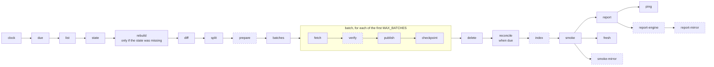
```mermaid
flowchart LR
  clock --> due --> list --> state --> rebuild["rebuild<br/>only if the state was missing"] --> diff --> split --> prepare --> batches
  subgraph b["batch, for each of the first MAX_BATCHES"]
    direction LR
    fetch --> verify --> publish --> checkpoint
  end
  batches --> b --> delete --> reconcile["reconcile<br/>when due"] --> index --> smoke --> report --> ping
  smoke --> fr["fresh"]
  smoke --> sm["smoke-mirror"]
  report --> re["report-engine"] --> rm["report-mirror"]
  classDef hook stroke-dasharray: 5 5
  class prepare,verify,index,sm,re,rm hook
```

The verbs with a broken line are hooks. These hooks do no work until a mirror sets a value:

- `prepare` and `verify` do no work until `TL_KEY` has a value.
- `index` does no work until `INDEX` has a value.
- `smoke-mirror` does no work until a mirror fills it.

| Verb | Function |
|---|---|
| `pipeline`, `plan-pipeline` | The verbs in the diagram, in sequence, and the read-only half: `clock`, `list`, `state`, `diff`, `split` |
| `list` | `rsync -rL --list-only` of `SOURCE`, with `FILTER`. `normalise` writes it to `.run/upstream.txt` as `path TAB size TAB mtime`, in the sequence of byte values. A listing that does not have more lines than `LIST_FLOOR` stops the run. If rsync cannot read a directory, it exits 23, and `retry` accepts exit 23: the run continues. The listing then does not have the files of that directory, and `delete` removes them from the bucket, the same as files that upstream deleted. When rsync can read the directory again, a run fetches its files again |
| `state` | Downloads `.state/applied.txt.xz` from the bucket. If the file is missing, `state` tells `rebuild` to make it |
| `rebuild` | Makes a listing of the bucket. The new state has each key that the bucket contains with the number of bytes that upstream gives. It uploads the new state as one PutObject |
| `diff` | Writes `changed.txt`, `deleted.txt` and `paths.txt`. `changed.txt` has the lines that upstream has and the state does not have. It also has the file of each changed signed sha512. `deleted.txt` has the paths that the state has and upstream does not have |
| `split` | Rejects a tree that is larger than `CEILING_GB`, or a file that the disk cannot contain. It divides the delta into `batch-NNNN.txt` files of `BATCH_GB` each, with the decision batch last |
| `prepare` | A hook. If `TL_KEY` has a value and the delta has a `TL` path: it fetches the tlpdb and compares its signature with the pinned key |
| `batches` | Runs `fetch`, `verify`, `publish` and `checkpoint` for each of the first `MAX_BATCHES` batches. If there are remaining batches, it makes the file `.run/chain` |
| `fetch` | Copies the files of the batch into `staging/` with rsync, and copies the target of each symlink. If upstream deletes a path after the listing, `fetch` does not copy it |
| `verify` | A hook. If `TL_KEY` has a value: it compares each signed file and each container in the batch with the tlpdb |
| `publish` | Runs `label` on the batch. Then it runs `aws s3 cp --recursive` one time for each type, with the files of each type in a different tree. It sends each file as one PutObject, and it makes no listing of the bucket. The engine does not use `aws s3 sync`. The `FRESH_KEY` file goes last |
| `label` | Writes `.run/labels.txt`: the Content-Type of each file in staging, from its name and its first KiB. Refer to [Content types](#content-types) |
| `checkpoint` | Runs `merge` to add the uploaded files to the state. Then it uploads the state as one PutObject, and it deletes the files in staging |
| `delete` | Removes the keys in `deleted.txt` from the bucket, 1,000 in each call, and removes them from the state. It waits for the run that uploads the last batch |
| `reconcile` | If `due` wrote `.run/reconcile`, it runs `rebuild`. Then it deletes each key that is not a path of upstream, a key in `OWN`, or a directory of the state. Then it runs `reconciled` |
| `index` | A hook. If `INDEX` has a value: it runs `pages`, uploads the two sets of keys, and removes the keys of the directories that became empty. Then it moves `.state/indexed.txt.xz` to the new state. A mirror with a different landing page overrides `index` |
| `pages` | Writes a page for each directory that the run changed, from the state, into staging. The keys with no slash at the end go in one tree for each depth |
| `smoke` | Reads a sample back from `HOST`. The list below the table gives each item of the sample. Then it runs `fresh` and `smoke-mirror` |
| `fresh` | If `FRESH_KEY` has a value: it reads the clock of upstream in that file, from `HOST`. If the clock is more than `FRESH_HOURS` before the time of the run, it stops the run |
| `smoke-mirror` | A hook, empty here. A mirror with more items to read back writes it |
| `report-engine` | A hook: the rows of the engine in the run summary |
| `retry` | Runs a command a maximum of five times. After a transport error of rsync (exit 5, 10, 12, 30 or 35), it runs the command again, with backoff. It accepts exit 23 and exit 24, and the run continues. rsync exits 23 if it cannot read a path, and 24 if upstream deletes a file while rsync sends it. Thus, a directory that rsync cannot read does not stop the run, and `delete` removes its files, the same as files that upstream deleted. Only `LIST_FLOOR` stops a large loss |

The verbs in the table also run these verbs: `normalise`, `pull`, `push`, `batch`,
`label-trees`, `merge` and `remove`. `pull` and `push` move a key with xz compression
between the bucket and `.run`. A verb of a mirror can also run them.

`smoke` reads these items back from `HOST`, and it stops the run if one of them is not
correct:

- One key of each type that the run published. Its length in bytes must agree with the
  listing, and its Content-Type must agree with the label.
- The `FRESH_KEY` file, for its length. `smoke` reads it only if the state has it. While
  the engine fills an empty bucket, the runs that stop at `MAX_BATCHES` do not upload the
  decision batch. The bucket gives 404 for a key that it did not contain before.
- If `TL` has a value: `texlive.tlpdb.sha512`. It must be the same as the verified copy.
- If `INDEX` has a value: one page that `index` wrote, at its two keys.
- If `CANARY` has a value: that file, read as `libwww-perl`. It must be the same as the copy
  in the bucket, byte for byte.
- The first `.tar.gz` that is not empty. It must have no `Content-Encoding`.

`smoke` reads one byte of an object, and it gets the length of the object from the
headers. It does not use a HEAD: Cloudflare sends no `content-length` for `text/html`.
`smoke` also finds each path in the listing of upstream that rsync did not send. Each run
fetches these paths again, the report counts them, and the first 20 are warnings on the
run.

#### The bucket is the mirror, and the state is a cache

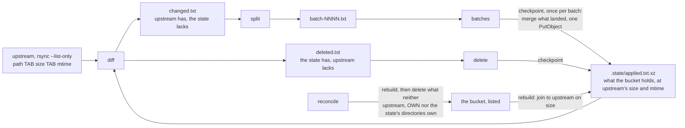
```mermaid
flowchart LR
  up["upstream, rsync --list-only<br/>path TAB size TAB mtime"] --> diff
  st[".state/applied.txt.xz<br/>what the bucket holds, at upstream's size and mtime"] --> diff
  diff --> ch["changed.txt<br/>upstream has, the state lacks"] --> split --> bt["batch-NNNN.txt"] --> batches
  diff --> de["deleted.txt<br/>the state has, upstream lacks"] --> delete
  batches -- "checkpoint, once per batch:<br/>merge what landed, one PutObject" --> st
  delete -- "checkpoint" --> st
  bucket["the bucket, listed"] -- "rebuild: join to upstream on size" --> st
  reconcile -- "rebuild, then delete what neither<br/>upstream, OWN nor the state's directories own" --> bucket
```

An hourly run makes one listing of upstream, and no listing of the bucket. The state line
is `path TAB size TAB mtime`, with the path first, in the sequence of byte values. Each
`sort`, `comm` and `join` of a listing runs with `LC_ALL=C`, because with a different
sequence `comm` compares the incorrect lines. This has three results:

- **The engine fills an empty bucket with no other step.** If the state file is missing,
  `rebuild` makes it from a listing of the bucket. An empty bucket gives an empty state,
  and the delta of the first run is the full tree. Each run does `MAX_BATCHES` batches, and
  it starts the next run with the chain until the bucket is full. No flag is necessary. The
  cost of a missing state file is one listing.
- **The state records only the uploaded files.** `merge` compares the batch with the files
  in staging. If upstream deletes a path after `list` runs and before `fetch` runs, the path
  does not go into the state. Thus, the state has no key that the bucket does not have.
- **`RECONCILE` is the check on a mirror that serves clients.** A reconcile always makes
  the state from the bucket again, one time in each `RECONCILE_HOURS` (the default is 24).
  Then it deletes the keys that upstream and the state do not have.

The engine writes the state one time for each batch, after it uploads the batch, as one
PutObject. If
a run stops before its end, the next run does one batch again, at most. A run that stops
at `MAX_BATCHES` with remaining batches is not a failure.

The bucket is the one item that a mirror cannot make again. The engine makes all other
data again from the bucket and from upstream. This includes the state file and the staging
tree.

#### The decision batch

`split` puts these files in the last batch: the files that a client reads to find the files
to fetch. These files are the `tlpkg/` of the signed subtree and each file at the root of
the bucket, for example `timestamp`. Thus, each container is in the bucket before the tlpdb
that gives its name. `delete` waits for the run that uploads the last batch. These are the
results:

- The tlpdb that clients read does not give the name of a container that `delete` removed.
- If `tlmgr` runs while the engine publishes a batch, it gets the tlpdb of the last run. It
  does not get a tlpdb that gives a file that is not in the bucket.

#### A signed subtree

If `TL` and `TL_KEY` have values, the engine verifies the signatures of TeX Live before it
publishes a file. `prepare` runs after `split`, before the first batch. `verify` runs on
each batch, before the engine uploads the batch.

The engine fetches the keyring from the same mirror as the signature, and it reads the
keyring as a plain file. Thus, gpgv imports no key before the check. Only the pinned
fingerprint is a check that the mirror cannot change: `VALIDSIG` must have `TL_KEY` at its
end. The engine also must find `GOODSIG`, because gpgv shows an expired or revoked key as
`VALIDSIG` with exit 0. `tlmgr` accepts such a key, but the engine does not.

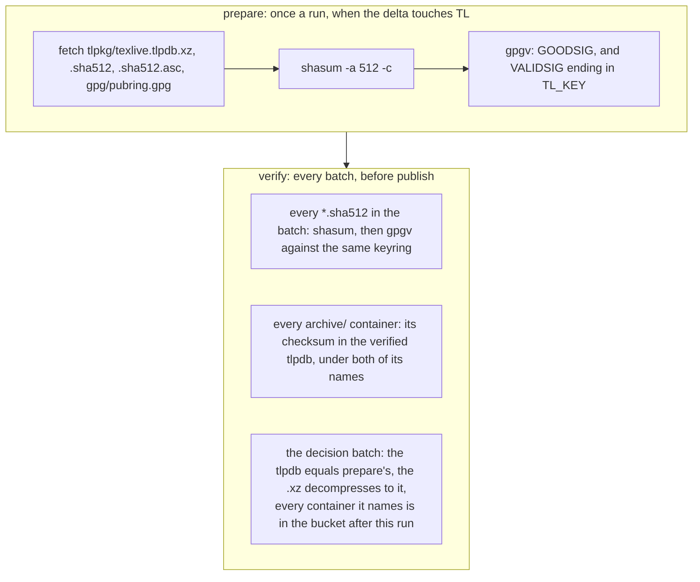
```mermaid
flowchart TB
  subgraph p["prepare: once a run, when the delta touches TL"]
    f1["fetch tlpkg/texlive.tlpdb.xz, .sha512, .sha512.asc, gpg/pubring.gpg"] --> f2["shasum -a 512 -c"] --> f3["gpgv: GOODSIG, and VALIDSIG ending in TL_KEY"]
  end
  subgraph v["verify: every batch, before publish"]
    v1["every *.sha512 in the batch: shasum, then gpgv against the same keyring"]
    v2["every archive/ container: its checksum in the verified tlpdb, under both of its names"]
    v3["the decision batch: the tlpdb equals prepare's, the .xz decompresses to it,<br/>every container it names is in the bucket after this run"]
  end
  p --> v
```

`verify` does these checks:

- It verifies each signed sha512 in the batch: `texlive.tlpdb.sha512`, and each sha512 at
  the root of the tree, for example the `install-tl*.sha512` and
  `update-tlmgr-latest.*.sha512` files.
- It compares each container in the batch with the `containerchecksum`,
  `doccontainerchecksum` or `srccontainerchecksum` in the verified tlpdb. A source container
  is `<name>.source.tar.xz`. If the tlpdb does not give a container, `verify` stops the run.
- In the decision batch, `texlive.tlpdb.xz` must decompress to the verified `texlive.tlpdb`,
  byte for byte. Each container that the tlpdb gives must be in the bucket after this run.

Upstream keeps each container with a name that has its revision, for example
`foo.r123.tar.xz`, and a symlink `foo.tar.xz` points to it. `fetch` uses `-L`. Thus, a
mirror serves the two names, unless its `FILTER` removes the names with a revision. The
`FILTER` of tlnet removes them. `verify` finds the checksum for the two names. It gets the
revision from the `revision` line of the stanza in the tlpdb.

If a check finds a problem in a batch, the engine does not upload that batch, and clients
continue to get the last good copy. After the engine uploads the batch, `smoke` reads
`texlive.tlpdb.sha512` back from the domain, and compares it with the verified copy.
`tlmgr` does the signature check again on the client.

#### Directory pages

R2 serves no directory listings. If `INDEX` has a value, `index` writes a page for each
directory that a run changed. It writes the pages from the state, not from upstream, and
each page has two keys:

- `<dir>/<INDEX>`: a Transform Rule of the zone serves this key for `/dir/`.
- `<dir>`, with no slash at the end: this key serves `/dir`. A mirror on a file system
  sends 301 for that URL. The URL does not show if a name is a file or a directory. Thus,
  no Cloudflare rule can send 301.

A `<base href>` lets one document serve the two URLs. A file system cannot contain `a/b` and
`a/b/` at the same time. Thus, `pages` puts the keys with no slash in one tree for each
depth, and `index` uploads one tree at a time. `index` gives these keys
`--content-type text/html`. Without it, a key with no suffix gets `binary/octet-stream`,
and a browser downloads the page and does not show it.

No page goes into the state. `merge` adds to the state only the files that are in staging
and also in the batch, and a page is in no batch.

`.state/indexed.txt.xz` records the state that the pages showed last. If a run stops before
it moves that file, the next run writes the same pages again. If you delete the file, the
next run writes all the pages again, one time. Thus, the pages of the directories that did
not change also get a change to the HTML of the page or to `PAGE_FOOT`. `reconcile` does
not delete the two keys.

The zone has one rule for each host:

```text
when:         ends_with(http.request.uri.path, "/")
rewrite path: concat(http.request.uri.path, http.host, ".directory.index.html")
```

This rule also serves the page of the root for `/`. In ctan, the rule does not include `/`,
because `/` serves the `index.html` of CTAN.

#### Content types

R2 serves the Content-Type that the object has in the bucket. Without a type in the
command, the AWS CLI uses the first half of the type that Python gets from the name. For
`foo.diff.gz`, Python gives a diff with gzip compression, and the CLI then stores
`text/x-diff`. A browser then shows the file as text.

The result of Python also changes with the image. Thus, the same type of file can have two
different Content-Types in one bucket. For these causes, `label` sets each type, and the
CLI sets no type:

1. A name with a `COMPRESSED` extension (for example `.gz`, `.tgz`, `.bz2`, `.xz`, `.Z`,
   `.zst` and `.lz`) gets that compressed type. The other parts of the name have no effect.
   The types are the types of ftp.gnu.org.
2. An extension that Python reads as compressed, and that is not in `COMPRESSED`, gets the
   type of its signature, or `application/octet-stream`. It does not get a text type.
3. If not, the `mime.types` of the image gives the type. But the name can give a type that
   a browser shows (text, XML, JSON, JavaScript, PDF), and the first KiB can show a
   different type. Then the bytes set the type. This occurs if the first KiB has a
   compression signature or a NUL, or if a PDF has no `%PDF-`.
4. A name with no type gets its type from the bytes. A known signature gives its type. If
   the bytes have no NUL, the type is `text/plain`. If they have a NUL, the type is
   `application/octet-stream`.

A control byte is not a NUL. Thus, a `.sty` file of CTAN with a `^Z` at its end stays
`text/x-tex`. Three checks make sure that `label` obeys these rules:

- `offline` gives a set of names and bytes to `label`, and stops on each change. If an
  update of the image changes `mime.types`, this check shows it.
- `smoke` reads one key of each type back from the domain, and compares the served type
  with the label.
- The `.tar.gz` check makes sure that tarballs have no `Content-Encoding`.

#### The vars

A mirror always sets `SOURCE`, `BUCKET` and `HOST` in its root vars. All other vars have an
inline default, and a mirror sets only the vars that are different:

| Var | Default | Function |
|---|---|---|
| `CEILING_GB` | 0, no ceiling | `split` rejects a tree that is larger than this number of decimal GB |
| `BATCH_GB` | 4 | Decimal GB in each batch. A larger file is a batch with no other file |
| `MAX_BATCHES` | 4 | The batches in each run. The next run, which the chain starts, does the other batches |
| `LIST_FLOOR` | 0, no guard | A listing that does not have more lines than this number is truncated, and the engine does not use it to delete keys. Set it to approximately 90% of the usual number of lines |
| `RECONCILE`, `RECONCILE_HOURS` | `auto`, 24 | The vars of the toolbox: refer to [When a reconcile runs](#when-a-reconcile-runs) |
| `RETRY_BASE` | 15 | Seconds. Before retry `i`, `retry` waits `RETRY_BASE * 2^i` seconds, plus jitter |
| `TL`, `TL_KEY` | Empty | A signed TeX Live subtree, and the fingerprint of the key that signs it. If they are empty, the engine does no signature checks |
| `FILTER` | Empty | rsync filter arguments that make the listing smaller, for a mirror of a subtree |
| `OWN` | Empty | Keys at the root of the bucket that the mirror writes, not upstream. A space is between two keys. `reconcile` does not delete them |
| `INDEX` | Empty | The key suffix of the directory pages. If it has a value, `index` writes the pages. `reconcile` does not delete the pages, or a key with the name of a directory of the state |
| `PAGE_FOOT` | Empty | The HTML at the end of each directory page. `%s` is the encoded path of the directory, and `%%` gives one `%` |
| `CANARY` | Empty | A file that `smoke` reads from the domain as a Perl client, and compares with the bucket, byte for byte. All files can be the canary. A file with `http://` links (not `https://`) or `mailto:` addresses also finds the HTML rewriters of the zone. The path must have no character that a URL encodes |
| `FRESH_KEY` | Empty | A file in which upstream records its clock, as Unix time or as `YYYY-MM-DD-HH-MM` (the format of CTAN). If it has a value, `fresh` stops the run when the clock is more than `FRESH_HOURS` before the time of the run |
| `FRESH_HOURS` | 24 | Hours. This value is less than 28 hours: at 28 hours, the mirror checks of GNU and CTAN show a problem |

A var in the root `vars:` of a mirror has the same value for all runs. In an included verb,
the run uses a root value, not a `KEY=value` on the command line. A var that the mirror
does not set keeps its default, and each run can set it:
`task sync -- MAX_BATCHES=8 RECONCILE=true`.

Do not set a root var to the default of the engine. If you do, the command line cannot
change that var.

#### When a run fails

The job log shows the step that stopped the run. The name of that step is the verb. The
table in this section gives each verb of the engine that can stop a run, with the cause and
the repair. The README of a mirror gives only the values of that mirror: its ceiling, its
upstream, and the steps that only that mirror has.

To find the step, and the number of files that the mirror does not have, use these
commands:

```sh
gh run list --workflow sync.yml --limit 5
gh run view <id> --log-failed | tail -50
curl -sI https://<HOST>/<FRESH_KEY> | grep -i -E 'last-modified|cf-cache-status'
aws s3 cp s3://<BUCKET>/.state/applied.txt.xz - | xz -d | wc -l
```

Compare the number of lines in the state with the number of lines in the listing. The
difference shows how many files the mirror does not have.

You can always start the run again, unless a row of the table tells you differently. A
second run writes the same bytes again, or it writes no bytes. To start it, use
`gh workflow run sync.yml` or `task sync`.

The state has the batches until the last checkpoint, and the second run calculates the
remaining delta again. While the engine fills an empty bucket, this second run continues
the work. On a laptop,
`task sync` uses `op run`. Thus, sign in to the 1Password CLI first.

| Verb | Cause | Repair |
|---|---|---|
| `image` | The toolbox could not download the image from GHCR. The mirror has no problem: the run uploaded no file, and the state did not change | Start the run again |
| `list` | The listing does not have more lines than `LIST_FLOOR`. The engine does not use a truncated listing to delete keys | Start the run again. If the problem continues, examine upstream. If upstream became more than 10% smaller, decrease `LIST_FLOOR` |
| `retry`, in `list`, `prepare` or `fetch` | rsync gave a transport exit five times. If upstream moved, each run uses approximately ten minutes for the retries, and then it stops | Examine `SOURCE`. If upstream moved, change `SOURCE` in the Taskfile |
| `split`: the ceiling | The tree is larger than `CEILING_GB`. The mirror gets no new files until you increase `CEILING_GB`. A larger ceiling also increases the cost | Increase `CEILING_GB` |
| `split`: the disk | One file of the delta is too large for the disk of the runner, with 1 GiB free for the other data. The log shows `no room for <path>`. `CEILING_GB` has no effect on this check | Remove the file from the listing with `FILTER`, or give the run a larger disk |
| `prepare`, `verify` | A signature or a checksum did not agree. The engine uploaded no file from that batch, and clients continue to get the last good copy | If TeX Live changed its key, compare `TL_KEY` with https://www.tug.org/texlive/verify.html. Do not use a different source for the key |
| `smoke`: the canary | The domain served bytes that are not the bytes in the bucket, or it rejected a Perl client. A zone rule is missing, or the scope of a zone rule became wider. The bucket is correct | Examine the Configuration Rule of the zone. Refer to [The parts of a bucket](#the-parts-of-a-bucket) |
| `smoke`: the Content-Encoding | A `.tar.gz` had a `Content-Encoding` when `smoke` read it. Clients then decompress it while they download it | Examine `label` and the AWS CLI version in `toolchain.lock.toml`. Refer to [Content types](#content-types) |
| `smoke`: the type or the length | A key of the sample had a Content-Type that is not its label, or a length that is not its length in the listing. The CLI, R2 or the zone changed the object | Examine `label` and the AWS CLI version in `toolchain.lock.toml`. Then examine the rules of the zone |
| `fresh`: the clock stopped | The clock in the `FRESH_KEY` file did not change for more than `FRESH_HOURS`. Upstream stopped, or the mirror that `SOURCE` gives stopped. A secondary mirror can stop, and rsync can continue to connect to it. The run copied all the bytes that it got | Examine upstream. If `SOURCE` is a secondary mirror, set `SOURCE` to a different secondary mirror. If upstream stopped, no change in the mirror is necessary |

These procedures repair other problems:

- **The state is not correct.** Use this procedure if the state file is damaged, or if you
  do not know if it is correct. It makes the state again from the bucket:

  ```sh
  gh workflow run sync.yml -f vars='RECONCILE=true'      # or: task sync -- RECONCILE=true
  ```

  The run makes a listing of the bucket, and compares it with the listing of upstream. It
  accepts each object with the length that upstream gives as correct. Thus, if a file
  changed but kept its length while the state was not correct, the run does not find the
  change. It finds the change when upstream changes the file again. `rebuild` uploads only
  the new state, and no file of upstream. This procedure is not necessary for a missing
  state file: the next run makes it.
- **Fill an empty bucket.** No flag is necessary. An empty bucket gives an empty state, and
  the delta is the full tree. Each run does `MAX_BATCHES` batches (4), and then it starts
  the next run with the chain. For more batches in each run, use
  `gh workflow run sync.yml -f vars='MAX_BATCHES=8'`. Before the engine fills an empty
  bucket, pause the healthcheck (refer to [Monitoring](#monitoring)).
- **Delete one key.** Use `aws s3 rm s3://<BUCKET>/<key>`. While the Cache Rule of the zone
  bypasses the cache, the edge contains no copy to remove. If upstream has the key, the next
  reconcile finds that the key is missing, and the subsequent run fetches it again. Do not
  edit the state manually to get the key back before the next reconcile. An error in the
  state can make the engine delete or fetch the incorrect files.
- **Write all directory pages again.** Use `aws s3 rm s3://<BUCKET>/.state/indexed.txt.xz`.
  The next run writes the page of each directory at its two keys. This procedure is safe:
  it does not change the files in the bucket.
- **A directory URL gives 404.** The page is at its key, with or without the zone rule. Use
  `curl -sI https://<HOST>/<dir>/<INDEX>`. If this command gives 200 and the directory URL
  does not, the Transform Rule is missing, or its scope is not correct.
- **Change a secret.** Edit the `r2` section of the item of the mirror in the 1Password app.
  Then use `gh workflow run sync.yml && gh run watch`. After a run with no failure, delete
  the previous R2 token in the Cloudflare dashboard. This procedure is safe: the first call
  with the new credentials only reads.
- **Abort a multipart upload that did not complete.** Find the upload. Then abort it:

  ```sh
  aws s3api list-multipart-uploads --bucket <BUCKET> --query
  'Uploads[].[Key,UploadId,Initiated]' --output text aws s3api abort-multipart-upload
  --bucket <BUCKET> --key <key> --upload-id <id>
  ```

  This procedure is safe, and it has no cost. If you do not do it, R2 aborts the upload
  after 7 days.

### The proton engine

`engines/proton.yml` copies a staging tree into one Proton Drive folder, with the
`proton-drive` CLI of Proton. It is for a mirror that can copy its full upstream in one run.
The mirror fills `staging/`, and the engine does all the other steps.

The bucket contains only the CLI session of the mirror. The engine keeps no other data
there, because of these two facts:

- The CLI does not upload a file if Proton has its content.
- `-f create-new-revision` makes a new revision of a file that changed.

Thus, the version history of Proton is the history of the mirror.

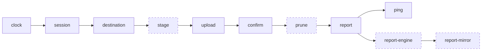
```mermaid
flowchart LR
  clock --> session --> destination --> stage --> upload --> confirm --> prune --> report --> ping
  report --> re["report-engine"] --> rm["report-mirror"]
  classDef hook stroke-dasharray: 5 5
  class stage,prune,re,rm hook
```

| Verb | Function |
|---|---|
| `pipeline`, `plan-pipeline` | The verbs in the diagram, in sequence. The read-only half runs to `stage`, and then prints the number of files and MB that the engine can upload |
| `session` | Downloads `.state/session.tar.age` from the bucket, decrypts it with `MIRROR_AGE_IDENTITY`, and puts the two session files from the tar into `.run/session` |
| `destination` | Makes a listing of the parent of `MIRROR_PROTON_DESTINATION`. It stops the run unless the parent has one folder of that name, and only one, with the UID `MIRROR_PROTON_DESTINATION_UID` |
| `stage` | A hook that each mirror writes. It fills `staging/` with the files that Proton must contain |
| `upload` | Runs one `filesystem upload -f create-new-revision -d merge -t --json` of `staging/*` into the destination. It writes the summary to `.run/upload.json` |
| `confirm` | In the summary, `transferredItems` and `skippedItems` together must be equal to the files and folders in staging, and `failedItems` must be 0. It writes the result to `.run/confirm.txt` |
| `prune` | A hook, empty here. A mirror that moves to the trash the items that its upstream deleted writes it, with `list-folder` and `trash` |
| `pd` | Runs each CLI call, and writes the stderr of the call to `.run/pd.err`. After each call, with all exit codes, it examines the session. If the token changed, it seals the session back into the bucket |
| `list-folder`, `trash` | `list-folder` writes the JSON listing of a folder to `OUT`. `trash` moves the nodes at `PATHS` to the trash of Proton |
| `session-seal -- <dir>` | On the host: it encrypts the two files of a laptop login into the bucket |
| `empty-trash` | On the host: it deletes all the items in the trash of Proton, permanently, but only after you tell it to continue |
| `report-engine` | A hook: the rows of the engine in the run summary |

The verbs in the table also run these verbs: `session-push`, `seal`, `age`, `pull`, `push`
and `empty-trash-pipeline`. `pull` and `push` move a key between the bucket and `.run`,
with no compression. A verb of a mirror can also run them.

The stderr of `list-folder` goes to the log of the run, not to `.run/pd.err`. Its command
has `|| echo "[]" > OUT` at its end. Thus, the stderr redirect of `pd` goes to the `echo`,
not to the CLI.

The engine reads no root var. It reads only the environment, with the names that the
`op.env` of each Proton mirror has:

| Name | Value |
|---|---|
| `MIRROR_PROTON_DESTINATION` | The CLI path of the destination folder, for example `/my-files/GitHub` |
| `MIRROR_PROTON_DESTINATION_UID` | The UID of that folder. Each run compares it before it writes the first file |
| `MIRROR_R2_BUCKET` | The bucket that contains the session |
| `MIRROR_AGE_IDENTITY` | The `AGE-SECRET-KEY-...` line that encrypts and decrypts the session |
| `AWS_ACCESS_KEY_ID`, `AWS_SECRET_ACCESS_KEY`, `AWS_ENDPOINT_URL_S3` | The credentials and the endpoint for `s3`. The proton mirrors use the `_S3` name for the endpoint. The AWS CLI and boto3 read the two names, `AWS_ENDPOINT_URL` and `AWS_ENDPOINT_URL_S3` |

#### The session

Only a sign-in in a browser can start a session of the CLI. Proton does not accept a new
sign-in from a datacenter address. Thus, you make the session one time on a laptop, and
each run gets it from the bucket, encrypted. The CLI changes the refresh token when it uses
the session. Thus, after each CLI call, `pd` examines the session. If the token changed,
`pd` seals the session back into the bucket.

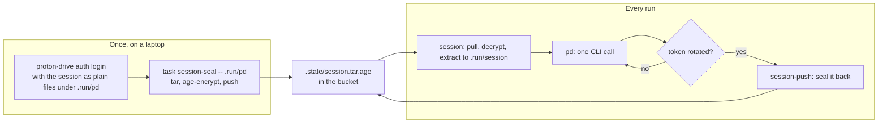
```mermaid
flowchart LR
  subgraph laptop["Once, on a laptop"]
    l1["proton-drive auth login<br/>with the session as plain files under .run/pd"] --> l2["task session-seal -- .run/pd<br/>tar, age-encrypt, push"]
  end
  l2 --> key[".state/session.tar.age<br/>in the bucket"]
  subgraph run["Every run"]
    r1["session: pull, decrypt, extract to .run/session"] --> r2["pd: one CLI call"] --> r3{"token rotated?"}
    r3 -- yes --> r4["session-push: seal it back"]
    r3 -- no --> r2
  end
  key --> r1
  r4 --> key
```

To make a session, do these steps on a laptop:

1. On the Settings page of your Proton account, set telemetry to OFF. Do this for each
   Proton account.
2. Run these commands:

   ```sh
   export PROTON_DRIVE_CACHE_DIR=.run/pd PROTON_DRIVE_CREDENTIALS_STORE=unsafe_file
   proton-drive auth login                                   # a browser opens; .run/pd holds two JSON files after
   proton-drive filesystem create-folder /my-files <Name>    # /my-files is the drive's own root, not a folder you make
   proton-drive filesystem list -j /my-files                 # the entry named <Name>: its uid is the destination UID
   task session-seal -- .run/pd                              # once the bucket and the vault exist
   ```

Install the CLI at the version that `toolchain.lock.toml` pins. The format of the session
file changes with the version, and the Linux binary in the image must read the files that
the laptop wrote. Put `.run/pd` in the repository, because the container gets only the
repository. git ignores `.run/`, and `task clean` deletes it.

Obey these three rules:

- Do not let two mirrors use one session. The CLI changes the refresh token at each call.
  Then Proton rejects the token that the other mirror has, and a new login is necessary.
- Do not run `task sync`, `task plan` or `task empty-trash` from a laptop while an Actions
  run can be in progress. The three commands use the one session. If the laptop and the run
  use it at the same time, a new login can be necessary.
- Do not keep a history of the session in the bucket. A previous copy contains a token that
  the CLI changed, and the CLI cannot use that copy.

### A pipeline of a mirror

A mirror that uses a program for its work writes `pipeline` and `plan-pipeline` in its
Taskfile. Their steps are the `clock`, `report` and `ping` of the toolbox, and the steps of
the program. The mirror puts these two verbs in `excludes:` in the engine entry of
`includes:`. dropbox has this structure:

- It includes the proton engine, which supplies `session`, `session-seal`, `empty-trash`,
  `pull` and `push`.
- Each step is one `python -m migrator <command>`.
- The Taskfile sets the sequence of the steps.
- The Python makes each decision, but the `due` of the toolbox finds if a run does a
  reconcile.
- The `proton` image supplies the interpreter, boto3 and the CLI.

A mirror of this structure fills `report-mirror` with its report. It changes no other part
of the toolbox.

## Secrets

All credentials and all account identifiers are in one vault, and a run gets each of them
with its name. A repository contains only `op://` references.

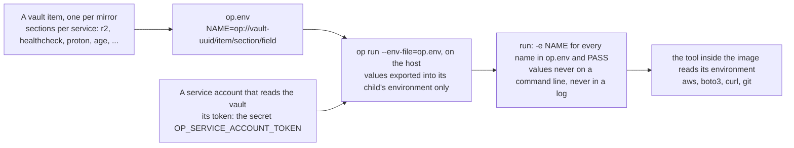
```mermaid
flowchart LR
  item["A vault item, one per mirror<br/>sections per service: r2, healthcheck, proton, age, ..."] --> ref["op.env<br/>NAME=op://vault-uuid/item/section/field"]
  ref --> oprun["op run --env-file=op.env, on the host<br/>values exported into its child's environment only"]
  sa["A service account that reads the vault<br/>its token: the secret OP_SERVICE_ACCOUNT_TOKEN"] --> oprun
  oprun --> run["run: -e NAME for every name in op.env and PASS<br/>values never on a command line, never in a log"]
  run --> tool["the tool inside the image reads its environment<br/>aws, boto3, curl, git"]
```

### The vault

There is one vault, with one item for each mirror. Each item has the name of its
repository. An item has one section for each system that the mirror uses (`r2`,
`healthcheck`, `proton`, `age`, `github`, `dropbox`). The README of the mirror gives the
names of the fields. The name and the UUID of the vault are not secrets: without the token
of the service account, they give access to no item.

The references give the UUID of the vault: `op://<uuid>/<item>/<section>/<field>`. Thus, if
the vault gets a new name, the runs continue to operate. Also, a reference cannot contain a
vault name that has a slash. To find the UUID, use this command:

```sh
op vault get <name> --format json | jq -r .id
```

One service account can read that vault, and no other vault. Its token is the secret
`OP_SERVICE_ACCOUNT_TOKEN`:

- On an organization, the token is one organization secret that all repositories inherit.
- On a personal account, the token is one repository secret for each mirror.

Only a dispatched sync run gets the token. A check of a pull request gets no secret.

### On the host

`op run --env-file=op.env` gets the value of each reference. It exports the values into the
environment of one command, `task run -- ...`. The output of that command does not show the
values, because `op run` removes them. On a laptop, `op` uses the desktop app, and you must
sign in to the app. In Actions, `op` uses the token of the service account, which the
reusable workflow puts in its environment. A run reads the vault one time.

### Into the container

For each name in `op.env` and in the `PASS` of the mirror, `run` gives `-e NAME` to the
container runtime. It also always gives `HEALTHCHECK_URL`, `GITHUB_STEP_SUMMARY` and
`GITHUB_RUN_ID`. The container runtime copies the value of each variable that `run` gives
from the environment of the host. Thus, no value is on the command line.

If the pipeline reads a host variable that `op.env` and `PASS` do not give, the variable is
empty in the container. `GITHUB_STEP_SUMMARY` is a path on the runner. Thus, `run` gives
the variable, and it also puts the file into the container at that same path.

### The names

| Name | The tool that reads it | Its source |
|---|---|---|
| `AWS_ACCESS_KEY_ID`, `AWS_SECRET_ACCESS_KEY` | The AWS CLI and boto3 | The `r2` section |
| `AWS_ENDPOINT_URL` | The AWS CLI, in the `rsync` image | The `endpoint` field of the `r2` section |
| `AWS_ENDPOINT_URL_S3` | boto3, in the `proton` image. The AWS CLI also reads it | The same field. The proton mirrors use this name |
| `AWS_REGION` | The two tools | The value `auto`, in the image. R2 has one region. If `op run` removes the value `auto` from the output, the output is incorrect |
| `MIRROR_R2_BUCKET` | `s3`, in the proton engine | The `bucket` field of the `r2` section |
| `MIRROR_AGE_IDENTITY` | `age`, in the proton engine | The `age` section |
| `MIRROR_PROTON_DESTINATION`, `_UID` | `destination`, in the proton engine | The `proton` section |
| `HEALTHCHECK_URL` | `ping`, `ping-fail` | The `healthcheck` section. It is optional |
| `MIRROR_*` names that one mirror uses | That mirror | A section for that mirror: `github`, `dropbox` |

### Without a vault

A mirror with no `op.env` runs on the secrets of its caller:

- The reusable workflow exports each inherited secret into the environment of the sync
  step, with its name.
- The secrets that the mirror gives in `PASS` go into the container.
- The workflow does not install the 1Password CLI.

On a laptop, the run uses the exported variables. This method is not the usual method. It
operates, but it puts the values in a second location.

## Storage

Each mirror has one S3-compatible bucket. The contents of the bucket are different for each
engine.

| Engine | Key | Contents |
|---|---|---|
| rsync | Each path of upstream, at the root | The mirror. A public domain serves the bucket |
| rsync | `.state/applied.txt.xz` | The state: the keys that the bucket contains, with the length and the mtime of upstream |
| rsync, with `INDEX` | `.state/indexed.txt.xz`, `<dir>/<INDEX>`, `<dir>` | The state that the directory pages showed last, and the pages with their two keys |
| rsync, a key of the mirror | `index.html` | The landing page of tlnet. `reconcile` does not delete it, because it is in `OWN` |
| proton | `.state/session.tar.age` | The CLI session, encrypted. This is the only key |
| A mirror with its pipeline | `.state/state.sqlite.xz.age`, `.state/history/<epoch>-<label>...` | The state of dropbox and its copies with a date. A lifecycle rule of the bucket deletes the history after a time |
| Each mirror that does a reconcile | `.state/reconciled` | The start epoch of the run that completed the last reconcile. The `push` of the engine writes it. With rsync, it has xz compression but no `.xz` suffix. With dropbox, it is plain text |

The engines keep only one prefix for their data: `.state/`. No upstream of the organization
has a `.state` entry at its root. The root of gnu has other dot-files, `.header.shtml` and
`.message`. The engine copies them the same as all other files.

### The parts of a bucket

- **A bucket.** Its name is in the `BUCKET` root var of the mirror (rsync), or in the
  `r2/bucket` field of the vault (proton).
- **An API token with Object Read & Write, with the scope of that bucket only.** Thus, if an
  unwanted person gets the token, the token gives access to only one bucket. Its ID and its
  secret are in the `r2` section.
- **The endpoint.** On R2, it is `https://<account-id>.r2.cloudflarestorage.com`, in the
  `endpoint` field of the `r2` section. All S3 endpoints operate: the engines use no
  function that only R2 has.
- **A custom domain on the bucket**, for a public mirror. This domain is `HOST`. Its zone
  has Cloudflare rules, each with the scope of the hostname of the mirror. You set these
  rules one time, not in the pipeline, and the pipeline does not change them. The pipeline
  makes no call to the Cloudflare API. The README of each public mirror gives its rules.

Each public mirror has a Configuration Rule. It sets these four items of the zone to Off:

- Email Obfuscation
- Rocket Loader
- Automatic HTTPS Rewrites
- Browser Integrity Check.

The first three change HTML while the zone serves it. The fourth sends 403 to Perl and
Python clients. The canary stops the run if one of them is on again.

### R2 specifics

On R2, the cost is storage and Class A writes. Egress has no cost. Thus, R2 is the default.
A full CTAN mirror is approximately 140 GB: approximately $2.10 a month, at $0.015 for each
GB-month.

R2 has a free tier for each account, not for each bucket. The free tier is 10 GB-month of
storage, 1 million Class A operations and 10 million Class B operations each month. All six
buckets are in one account, and ctan, gnu and nongnu use all of the free tier. Thus, each
README gives gross costs: storage only, at $0.015 for each GB-month, with no free tier
subtracted.

The engines use these facts about R2:

- `AWS_REGION=auto` is an `ENV` line in the two images.
- R2 rejects the default checksum headers of the SDK. Thus, the `proton` image sets
  `AWS_REQUEST_CHECKSUM_CALCULATION` and `AWS_RESPONSE_CHECKSUM_VALIDATION` to
  `when_required`.
- R2 does not give keys in the sequence of byte values. Thus, the engine sorts each
  listing of the bucket again before `join` or `comm`.
- The limit for an upload in one part is 4.995 GiB. The `rsync` image sets
  `AWS_CONFIG_FILE` to its `/etc/aws.config`. In that file, `multipart_threshold` and
  `multipart_chunksize` make the CLI send a file larger than 4 GiB in parts of 512 MiB. The
  cost of a multipart upload is one Class A operation for each part.
- `DeleteObjects` accepts 1,000 keys in each call, and it has no cost. The CLI exits 0 when
  `DeleteObjects` gives errors. Thus, `remove` examines the response: if it has an `Errors`
  array, `remove` stops the run.

## Monitoring

Three systems monitor a mirror. The toolbox supplies data to each of them.

**healthchecks.io.** `ping` is the last verb of each pipeline. `ping-fail` runs from the
failure path. Each mirror has a check:

- The check has a cron expression, with the same times as the slots of the mirror. A check
  with a period starts its period again at each ping. Thus, if the runs start after their
  slots for a long time, the times of the check move, and the check does not show it. A
  cron expression keeps the time of each ping on its slot.
- The grace is sufficient for a run in the queue and one full run. A run that the
  scheduler starts during a run waits for it (`concurrency`: one pending run for each
  group). Thus, a ping
  can occur a long time after its slot.
- If a slot gets no ping in the time of the grace, healthchecks.io sends an email.
- No step sends `/start`. Thus, the grace is not a limit on the length of a run. Before the
  engine fills an empty bucket, or before a large delta, pause the check in the
  healthchecks.io UI. A run of many
  hours can be longer than the grace. A paused check starts again at its next ping.
- No part of a mirror starts a run. Thus, the check also monitors the scheduler,
  [katoptra/dispatch](https://github.com/katoptra/dispatch). A tick that does not start a
  run and a pipeline that stops before its end give the same result: no ping.
- Without `HEALTHCHECK_URL`, `ping` sends no request, and healthchecks.io sends no email
  for the mirror.

**The run summary.** `report` adds one table to the job page in Actions. The table has three
layers: the rows of the toolbox, the rows of the engine and the rows of the mirror. `report`
counts all values from `.run/`, not from the log, because Actions removes log lines after a
limit and shows no warning. Read this table first if a run had no failure but its result is
not correct.

`report` finds the job page with `GITHUB_STEP_SUMMARY`. If the summary of a run shows in
the step log, that variable did not go into the container.

**katoptra.org.** The `status.js` of the site reads the healthchecks.io badge and the
Actions run list of each mirror when a person opens the page. Thus, each tile shows the
status and the last sync time at the time that a person opens the page.

On a public repository, the logs of a run are public. A pipeline writes counts and phase
lines in the log. It does not write a path name, a credential or an account identifier
there:

- The output of `op run` does not show the values that it got.
- The stderr of git and of the CLI goes to files in `.run/`. But the stderr of
  `list-folder` goes to the log.
- A failure gives the position of an item in the listing, not its name.

The `trash` verb of the proton engine is different. The log shows the command of `trash`,
with each path that `trash` moves to the trash.

## The images

There is one image for each engine. lib builds the images, and each run downloads its image
from GHCR. A run does not build an image, and it does not use Docker Hub.

| Variant | Base | Tools | For |
|---|---|---|---|
| `rsync` | ubuntu 24.04 | rsync, gpgv, xz, curl, perl (shasum), go-task, AWS CLI v2 with only s3 and sts | rsync upstreams into a bucket: ctan, tlnet, gnu, nongnu |
| `proton` | python 3.13 slim | proton-drive, age, git, go-task, boto3, requests, pytest, ruff, and `s3`, a boto3 script that gets and puts objects | Proton Drive sinks: github with the proton engine, dropbox with its Python |

The two images have these properties:

- Each image uses the repository at `/work`, as a bind mount.
- Each image sets `TASK_REMOTE_OFFLINE=1` and `AWS_REGION=auto`.
- Each image pins its base with a digest.
- The last stage of each image makes sure that each tool shows the version in
  `toolchain.lock.toml`.

### `toolchain.lock.toml`

`toolchain.lock.toml` is one file for all the images. For each tool, it gives the version
and, for each architecture, the archive and its checksum. `docker/lock.py` reads this file
for the Dockerfiles and for the toolbox action. The build examines each tool before it uses
it.

The AWS CLI has a different check. Upstream publishes no checksum for it, only a detached
PGP signature. Thus, the fetch stage verifies the signature with `docker/aws-cli.pub`, and
it must find the fingerprint that `toolchain.lock.toml` pins. It uses the same GOODSIG and
VALIDSIG check that the engine uses for TeX Live. On each CI run,
`docker/gpg-gate-check.sh` makes sure that this check rejects each signature that it must
reject.

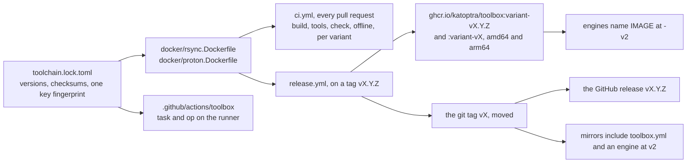
```mermaid
flowchart LR
  lock["toolchain.lock.toml<br/>versions, checksums, one key fingerprint"] --> df["docker/rsync.Dockerfile<br/>docker/proton.Dockerfile"]
  lock --> act[".github/actions/toolbox<br/>task and op on the runner"]
  df --> ci["ci.yml, every pull request<br/>build, tools, check, offline, per variant"]
  df --> rel["release.yml, on a tag vX.Y.Z"]
  rel --> ghcr["ghcr.io/katoptra/toolbox:variant-vX.Y.Z<br/>and :variant-vX, amd64 and arm64"]
  rel --> tag["the git tag vX, moved"]
  tag --> gr["the GitHub release vX.Y.Z"]
  tag --> inc["mirrors include toolbox.yml and an engine at v2"]
  ghcr --> img["engines name IMAGE at -v2"]
```

There are two types of pin, with one policy:

- The URLs in `includes:` and the image use the git tag `v2`, and the tag moves. When it
  moves, a change to a verb or a tool goes into each mirror at its next run.
- Each mirror pins each `uses:` of a lib workflow to the commit of a release, and
  Dependabot updates it. The repositories of the four public mirrors have an Actions
  policy: each `uses:` must have a full SHA. The other repositories pin each `uses:` with
  the same method.

A change that breaks the name or the contract of a verb is a new major version.

## The workflows

lib has two reusable workflows and one composite action. Each caller in a mirror has only
a small number of lines.

### `sync.yml`

This workflow does one run of one mirror. The caller is a `workflow_dispatch` that
[katoptra/dispatch](https://github.com/katoptra/dispatch) starts. The caller gives its
`vars` to this workflow, and this workflow inherits the secrets of the caller.

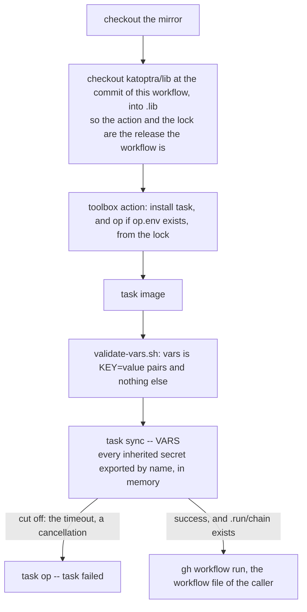
```mermaid
flowchart TB
  a["checkout the mirror"] --> b["checkout katoptra/lib at the commit of this workflow, into .lib<br/>so the action and the lock are the release the workflow is"]
  b --> c["toolbox action: install task, and op if op.env exists, from the lock"]
  c --> d["task image"] --> e["validate-vars.sh: vars is KEY=value pairs and nothing else"]
  e --> f["task sync -- VARS<br/>every inherited secret exported by name, in memory"]
  f -- "cut off: the timeout, a cancellation" --> g["task op -- task failed"]
  f -- "success, and .run/chain exists" --> h["gh workflow run, the workflow file of the caller"]
```

- **Inputs.** `vars` is a string of `KEY=value` pairs for the pipeline in the image.
  `timeout-minutes` has the default 355, less than the job limit of six hours. The caller
  sets `timeout-minutes` in `with:` only for a different value.
- **The vars guard.** The shell divides `vars` into words, and each word becomes a task
  variable. An engine can put a task variable into a command. Thus, a step that has no
  secrets examines each word. It rejects a word that is not a key in uppercase letters with
  a value that has no special characters. In
  CI, `validate-vars.sh --check` runs the test cases of the guard.
- **Concurrency.** The caller sets
  `concurrency: {group: sync, cancel-in-progress: false}`. Thus, a run that the scheduler
  starts during a run waits for that run. A group has only one pending run, and GitHub
  cancels the other pending runs. The delta of the next run includes the work of each
  canceled run.
- **The chain.** If the pipeline wrote `.run/chain`, the workflow dispatches the file of the
  caller again. With the chain, an empty bucket fills, and a run with a time limit
  continues. The chain is the only cause for `actions: write` in the caller. A called
  workflow cannot increase its permissions.
- **The image.** No cache keeps the image between jobs. Each job is a new VM, and it
  downloads the image from GHCR one time, before the pipeline. If the host has the image,
  the `status` guard of `image` does not download it again. Thus, the job downloads the
  image one time for all the `task run` commands. A cache of the image in Actions costs
  more work than the download that it prevents.

  If the run stops at `task image`, the toolbox could not download the image, and the mirror
  has no problem.

### `check.yml`

On each pull request, this workflow does a checkout of the mirror, and of lib at the same
commit. Then it runs the toolbox action without `op`, and `task check`. No secret goes into
this job. Thus, a pull request from a fork can run it safely. A mirror with an `offline`
verb sets `offline: true`. The job then also runs `task run -- task offline` in the image.

### The toolbox action

`.github/actions/toolbox` installs go-task on the runner. Unless `op: 'false'`, it also
installs the 1Password CLI. It uses the versions and the checksums in
`toolchain.lock.toml`. With this action, a runner can run `task sync`. All other tools run
in the image.

## Using it in a mirror

A mirror repository contains eight files:

```
Taskfile.yml                  root vars, the two includes, the hooks it fills
.taskrc.yml                   trusts raw.githubusercontent.com, refetches at most hourly
op.env                        op:// references, one per secret
render.txt                    the committed dry run
.gitignore                    .run/, .task/ and /staging/
.github/workflows/sync.yml    calls katoptra/lib/.github/workflows/sync.yml at a release commit
.github/workflows/check.yml   calls katoptra/lib/.github/workflows/check.yml at a release commit
.github/dependabot.yml        bumps the two calls on a lib release
```

### An rsync mirror

```yaml
# Taskfile.yml
version: '3'
vars:
  SOURCE: rsync://rsync.dante.ctan.org/CTAN/
  BUCKET: ctan
  HOST: ctan.katoptra.org
includes:
  toolbox:
    taskfile: https://raw.githubusercontent.com/katoptra/lib/v2/toolbox.yml
    flatten: true
    vars:
      NAME: ctan
      DESC: an hourly mirror of CTAN at https://ctan.katoptra.org/
  rsync:
    taskfile: https://raw.githubusercontent.com/katoptra/lib/v2/engines/rsync.yml
    flatten: true
```

```sh
# op.env
AWS_ACCESS_KEY_ID=op://<vault-uuid>/ctan/r2/access_key_id
AWS_SECRET_ACCESS_KEY=op://<vault-uuid>/ctan/r2/secret_access_key
AWS_ENDPOINT_URL=op://<vault-uuid>/ctan/r2/endpoint
HEALTHCHECK_URL=op://<vault-uuid>/ctan/healthcheck/url
```

That is a full mirror. The engine supplies `pipeline`, `plan-pipeline`, `report-engine`
and the `IMAGE`, `ghcr.io/katoptra/toolbox:rsync-v2`.

Each public mirror also sets these root vars:

- `LIST_FLOOR`: `list` uses it to find a truncated listing.
- `CANARY`: `smoke` uses it to find a zone that changes bytes or rejects a Perl client.
- `FRESH_KEY`: `fresh` uses it to find an upstream that stopped.

The other public mirrors have these structures:

- A mirror of one signed subtree, for example tlnet, adds `TL`, `TL_KEY`, `CEILING_GB`,
  `OWN` and a `FILTER` to its root vars. It puts `index` in `excludes:` in the engine entry
  of `includes:`. It writes an `index` that uploads its landing page, and a `report-mirror`
  with its row.
- A mirror with directories that a browser can show, for example ctan, gnu and nongnu, adds
  `INDEX` and `PAGE_FOOT` to its root vars. It adds the Transform Rule of
  [Directory pages](#directory-pages) to its zone. The engine does all the other work.

### A proton mirror

```yaml
version: '3'
vars:
  OWNERS: jshvn katoptra
includes:
  toolbox:
    taskfile: https://raw.githubusercontent.com/katoptra/lib/v2/toolbox.yml
    flatten: true
    excludes: [report-mirror]
    vars:
      NAME: github
      DESC: a daily mirror of every repository under {{.OWNERS}} into Proton Drive
  proton:
    taskfile: https://raw.githubusercontent.com/katoptra/lib/v2/engines/proton.yml
    flatten: true
    excludes: [stage, prune]
tasks:
  stage: {cmds: ['# list the repositories, clone each as a mirror, bundle it under {{.STAGING}}/<owner>/']}
  prune: {cmds: ['# list-folder each owner in Proton; trash the bundles no repository has']}
  report-mirror: {cmds: ['# the mirror rows']}
```

Its `op.env` has the seven names in [The proton engine](#the-proton-engine),
`HEALTHCHECK_URL`, and the names that only this mirror uses. The engine supplies the
`IMAGE`, `ghcr.io/katoptra/toolbox:proton-v2`.

### The other files

In the two workflow files, change `<release-sha>` to the commit SHA of a lib release.
Change `vX.Y.Z` to the version of that release.

```yaml
# .taskrc.yml
remote:
  trusted-hosts: [raw.githubusercontent.com]
  cache-expiry: 1h
```

```yaml
# .github/workflows/sync.yml
name: sync
on:
  workflow_dispatch:
    inputs: {vars: {type: string, default: ''}}
permissions: {contents: read, actions: write}   # the chain step; a called workflow cannot raise this
concurrency: {group: sync, cancel-in-progress: false}
jobs:
  sync:
    uses: katoptra/lib/.github/workflows/sync.yml@<release-sha> # vX.Y.Z
    with: {vars: '${{ inputs.vars }}'}
    secrets: inherit
```

```yaml
# .github/workflows/check.yml
name: check
on: {pull_request: {}}
permissions: {contents: read}
jobs:
  check:
    uses: katoptra/lib/.github/workflows/check.yml@<release-sha> # vX.Y.Z
```

```yaml
# .github/dependabot.yml
version: 2
updates:
  - package-ecosystem: github-actions
    directory: /
    schedule: {interval: weekly}
    groups: {actions: {patterns: ['*']}}
```

```
# .gitignore
.run/
.task/
/staging/
```

Then run `task render-update` one time. Commit `render.txt`. After that, use
`task check`. If a pull request changes the commands of the mirror, `render.txt` shows a
diff, and that diff is the review.

### Rules a mirror keeps

- **Root vars contain only the values of the mirror.** Do not set a root var to an engine
  default. If you do, the command line cannot change that var.
- **A task that a verb runs does not get the call vars of that verb.** Also, a root var
  cannot read a var of an included Taskfile. A verb can run a hook with a `RUN` or a
  `STAGING` that a caller can change. In that condition, the verb must give these vars to
  the hook. `smoke` does this.
- **Do not put `dir:` on a verb of an included Taskfile.** If task reads a flattened
  Taskfile of `includes:` from a path, it adds each `dir:` to the directory of that
  Taskfile, also an absolute `dir:`. Thus, `verify` starts each command with `cd`.
- **`render` puts an empty directory on `.run`.** Thus, a `sh:` var that reads `.run` when
  task reads the Taskfile gives the same render in each checkout. A verb that reads
  `.run` at that time must accept an empty `.run`.
- **`task run -- task <x>` exits 201 for each failure in the container.** A test can only
  examine that the exit is not 0.

## Changing it

### Overriding a verb, in a mirror

Put the verb in `excludes:` in the entry of `includes:` that has it. Then write the verb in
the mirror. A second verb with the same name and no `excludes:` is a parse error. Thus, a
mirror cannot override a verb without `excludes:`.

```yaml
includes:
  rsync:
    taskfile: https://raw.githubusercontent.com/katoptra/lib/v2/engines/rsync.yml
    flatten: true
    excludes: [index]          # the mirror draws its own landing page
tasks:
  index:
    cmds: [...]
```

Obey these rules when you override a verb:

- Keep the name and the function of the verb. A `verify` that does a different task is a
  new verb. Give it a new name. Add it to `MENU`.
- Add to a verb with a hook, not with a copy. A mirror that wants the `smoke` of the engine
  and more checks writes `smoke-mirror`, which `smoke` runs last. Do not put `smoke` in
  `excludes:` and copy it into the mirror. A copy does not get the changes of subsequent
  releases.
- The new verb reads the root vars of the mirror, the same as the verb of lib.
- Override engine verbs and the toolbox verbs that run in the container. Do not override
  the host verbs. `sync`, `plan`, `check` and `run` are the contract of the workflows and of
  the menu.

### Adding a hook or a verb, in an engine

Make each change to the transport of bytes, or to the checks on a tree, in the engine.
Then all mirrors get it. If two mirrors can copy a verb, put the verb in the engine. Obey
these rules:

- A new hook is an empty task, with a `desc` that gives the mirror or the engine that fills
  it. The verb that runs the hook gives it the vars that it uses.
- A new var that a mirror can set is an inline `{{.X | default N}}` in the command that
  reads it. Write the default one time. Add a row to the table in [The vars](#the-vars).
- A change to a verb is a change to `examples/<variant>/render.txt`. The diff of that file
  in the pull request is the review.

### A new engine

There is one engine for each transport, and one image variant for each engine. A new engine
is five files and two matrix entries:

1. **Tools.** Put the version of each tool, and its checksum for each architecture, in
   `toolchain.lock.toml`.
2. **Image.** Write `docker/<variant>.Dockerfile`. Use `docker/rsync.Dockerfile` as the
   example. The Dockerfile must have these properties:
   - A base with a digest pin
   - Each tool from `toolchain.lock.toml`
   - `TASK_REMOTE_OFFLINE=1`
   - A last stage that makes sure that each tool shows the version in `toolchain.lock.toml`.
3. **Verbs.** Write `engines/<variant>.yml` with the verbs of the pipeline: `clock` first,
   and `report` and `ping` last. Do not give a `vars:` default for a var that a mirror sets.
4. **Example.** Make `examples/<variant>/`. This example is the check of the engine. It
   must have these files:
   - A Taskfile with a `pipeline` that runs all the verbs
   - A committed `render.txt`
   - An `offline` verb that runs the verbs that do not use a bucket, on `fixtures/`.
5. **CI.** Add the variant to the `matrix` of `ci.yml` and of `release.yml`.

An HTTPS engine can use the same base as `rsync`, with curl and the AWS CLI. Its `list`
reads an index, not `rsync --list-only`.

### Updating a tool

Change its version and each checksum below it in `toolchain.lock.toml`. The last stage of
the Dockerfile stops the build if a tool does not show the new version.

The key that signs the AWS CLI has an end date: 2027-07-01. Before that date, get
`docker/aws-cli.pub` and the fingerprint again from the AWS CLI User Guide.

The session format of the Proton CLI changes with its version. After you update the Proton
CLI, do a new login on a laptop. Then run `session-seal` for each Proton mirror.

### Releasing

Tag a commit `vX.Y.Z`. Push the tag. The release workflow then does these steps:

1. It builds the two images for amd64 and arm64.
2. It uploads `<variant>-vX.Y.Z` and `<variant>-vX` to GHCR.
3. It moves the `vX` git tag.
4. It publishes the GitHub release `vX.Y.Z`. Its notes give the pull requests that the
   repository merged after the last release.

Each mirror that uses `vX` gets the change at its next run. Dependabot updates the
workflow callers. A change that breaks the name or the contract of a verb is a new major
version. Then each mirror changes its two `v2` strings manually.

## Working on it

```sh
git clone https://github.com/katoptra/lib
cd lib/examples/rsync  && task image-build && task run -- task tools && task check && task run -- task offline
cd ../proton           && task image-build && task run -- task tools && task check && task run -- task offline
```

These commands do these steps:

- `task image-build` builds the image of the example from `docker/`.
- `task run -- task tools` gets the version of each tool.
- `task check` makes a render of the pipeline of the example in the image, and compares it
  with `render.txt`.
- `task run -- task offline` runs the verbs of the engine that do not use a bucket, on
  `fixtures/`.

For rsync, `offline` does these checks:

- The list diff, `retry` and `due`
- `prepare` and `verify` on a signed subtree, with a test key that the example pins
- `pages`, compared with the page set of ctan, byte for byte, and the page read-back of
  `smoke`
- `label` on a set of names and bytes, and `label-trees` in the two directions
- `fresh` with three clocks: two that it accepts, and one from 48 hours before the check.

For proton, `offline` runs `confirm` on two upload summaries: one that it accepts and one
that it rejects. It also encrypts and decrypts one file with `age`. Then it does a dry run
of `empty-trash-pipeline` from the command line, because `empty-trash` starts that task from
the command line in the image.

CI runs the same four steps for each variant on each pull request and on each push to
`main`. It also runs the test
cases of the three guards: `.github/validate-vars.sh`, `.github/chain-file.sh` and
`docker/gpg-gate-check.sh`.

When you change a verb, run `task render-update` in each example. The diff in the pull
request is the review. `CONTRIBUTING.md` gives the three rules that this repository adds to
the rules of the organization.

## Recreating it from zero

These steps make the full system again, from zero. Do them in this sequence. Each step is
work that you do one time, manually. No repository does these steps.

1. **Accounts.** Make these accounts:
   - A GitHub organization, or a personal account. The difference is the location of the
     one secret.
   - A Cloudflare account with R2, and a zone for the domain of each public mirror.
   - A 1Password account with a service account.
   - A healthchecks.io account.
2. **The images.** Use `ghcr.io/katoptra/toolbox` with no change: the packages are
   public. Or, make images in your fork:
   1. Fork this repository.
   2. In the two engines, change the `IMAGE` default to the GHCR of your fork.
   3. In `release.yml`, change `ghcr.io/katoptra/toolbox` to the GHCR of your fork.
   4. Push a tag `v2.0.0` to your fork. `release.yml` builds the images and uploads them to
      your GHCR, with the token of the repository.
   5. Make the packages public, one time.
   6. In each mirror, change the URLs in `includes:` to your fork.
3. **The vault.** Make one vault. Record its UUID. Make one service account that can read
   the vault. Put its token in the organization secret `OP_SERVICE_ACCOUNT_TOKEN`.
4. **Actions policy.** Let the repositories use only GitHub-owned actions, `go-task/*`, and
   the actions of the organization. Set the policy that each `uses:` must have a full SHA.
   Dependabot updates the pins.
5. **A mirror.** Do these steps for each mirror:
   1. Fork one mirror.
   2. Edit its identity vars.
   3. Make its bucket, and a token with the scope of that bucket.
   4. For a public mirror, make its custom domain and its zone rules.
   5. Make its vault item, with the sections that its README gives.
   6. Put the UUID of the vault in `op.env`.
   7. Run `task check`.
   8. In Actions, select the sync workflow. Then select Run workflow.
   9. Make its healthcheck. Put the URL of the healthcheck in the vault item.
6. **A trigger for the runs.** Add a `schedule:` trigger to the `sync.yml` of the mirror,
   or use an external scheduler. GitHub disables a scheduled workflow in a public
   repository that has no commit, issue or pull request for 60 days. Thus, an external
   scheduler dispatches the katoptra mirrors.
7. **The site.** This step is optional. Fork katoptra/site. Add one entry for each mirror
   in `data/mirrors.toml`. Deploy the site on a static host.

Pull requests are welcome.

MIT licensed. Built by [Josh Vaughen](https://ijosh.com).
